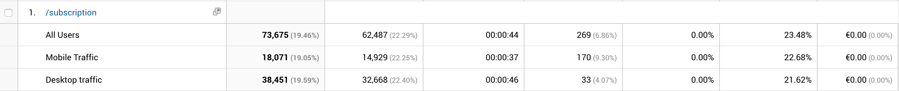

# 1.8 - Scope van de opdracht

Voor de scope van het project is er gekozen om te focussen op een product ontwerp voor desktop formaat.

De reden hiervoor is dat uit [survey onderzoek blijkt](../h3-ideen-en-inzichten/survey.md#resultaten-enquete), dat de meerderheid het liefst via desktop iets wilt wijzigen of wilt zoeken. Daarna komt tablet, en daarna mobiel.

De huidige situatie is daarnaast getest op desktop, hier zijn alle bevindingen uitgehaald.

Uit analyse van Google Analytics komt ook naar voren dat bij een wijziging, probleem of het zoeken van informatie desktop wordt gebruikt. Ook het gebruik van de account omgeving is veel hoger. 

Ook al zijn de meeste gebruikers mobiele gebruikers en goed voor 53,36% van de totale page views. Toch heeft desktop met 32.77% van de totale page views, een significant groter aandeel in het gebruik van de account omgeving en service omgeving. Zie onderstaande afbeeldingen voor een Google Analytics analyse.

Ook uit [analyse van interne documenten](../h2-onderzoek/2.1-interne-documenten.md) blijkt dat op desktop formaat de leeftijd een stuk hoger ligt. Daarom is het handig om de klantenzorg voor hen als eerst te optimaliseren. Waarna de jongeren doelgroep vanzelf daar van profiteert.

### Account statistieken

### Servicepagina statistieken

