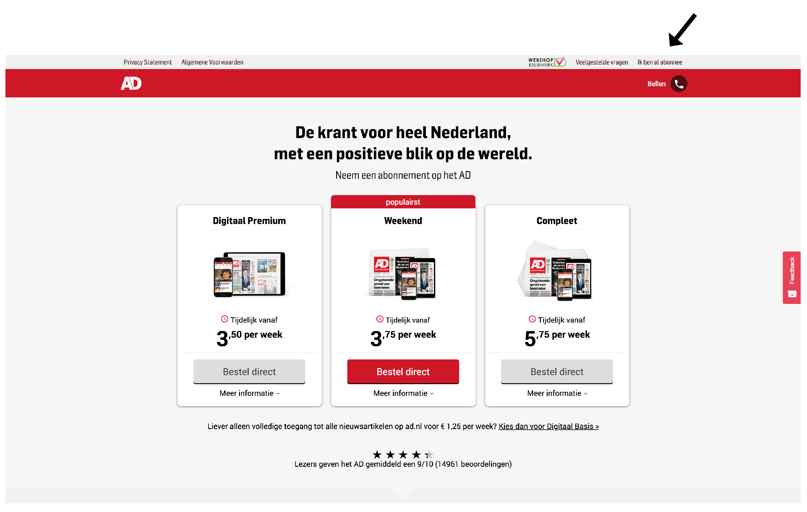

# 1.1 - Aanleiding opdracht


Dit is niet de eindsituatie, maar geeft de aanleiding weer van het ontstaan van het project. Kijk onder [1.3 Probleemsituatie](1.1.1-probleemsituatie.md) \(final\) voor de huidige omschrijving van het project.


## Aanleiding

In eerste instantie was het lastig om de kern van het verhaal te begrijpen dat door De Persgroep werd verteld. Dit verhaal is geschreven aan de hand van de design briefing v1.1. Dus nadat de situatie en context duidelijker waren geworden. **Dit is dus niet de eindsituatie.**

Door middel van een _orienting expert interview_ is er informatie vergaard over waar De Persgroep en het AD voor staat, en wat de context is van de opdracht.

De bevindingen van deze gesprekken zijn terug te vinden via volgende verwijzing:



### Het verhaal

Het begon allemaal met de knop 'Ik ben al abonnee' op de abonneer pagina \(zie onderstaande afbeelding\). Deze knop zit in de rechter bovenhoek. Bezoekers van AD.nl, die op de knop 'abonneren' drukken, komen op een pagina met abonnementsaanbiedingen terecht. Voor een deel van deze bezoekers, de abonnees van het AD,  is dit niet de pagina waarop zij de antwoorden kunnen vinden die zij zoeken. Daarom is er op deze pagina een knop 'ik ben al abonnee' geplaatst. Deze knop stuurt ze nu door naar de de pagina van klantenservice, [ad.nl/service](http://ad.nl/service).

Daarnaast ontbreekt er een pagina die de abonnees serviced en hun loyaliteit moet verhogen. Met loyaliteit wordt bedoeld de mate waarin een klant qua houding en gedrag trouw is aan je organisatie of product. Er zijn veel voordelen te halen als abonnee, maar die zijn moeilijk te vinden. Daardoor ontstaat volgens De Persgroep het gevoel bij de abonnees dat zij minder gewaardeerd worden. Maar ook bij niet-abonnees. Hierdoor loop je triggers mis die ervoor zorgen dat de abonnee een up-sell of een cross-sell doet. Of zelfs hun abonnement gaan opzeggen. Er moet een pagina komen waar het AD zijn ‘etalage’ kan tonen aan diensten en producten en die er voor zorgt dat de klant behouden blijft en goed geserviced wordt.

Volgens De Persgroep is het ook zo dat de druk op klantenservice veel hoger ligt dan voorheen. Dit kan dus te maken hebben met het feit dat abonnees online niet goed geholpen worden.

Volgens De Persgroep bleek dat 70% van de mensen die op 'Ik ben al abonnee' klikken, geen abonnees zijn. De reden hiervoor was volgens hen dat de niet-abonnee nieuwsgierig is wat er dan gebeurt als je dus wel abonnee bent. Ook voor de abonnee die hier wel op klikt geldt dit, maar wellicht verwachten zij ook dat er iets anders gebeurt na het klikken. Daarom is er een [onderzoek](../h2-onderzoek/tussenscherm-ik-ben-al-abonnee.md) bedacht om dit te achterhalen.

Zie verwijzing om meer te lezen over dit onderzoek



De opdracht zou dus eerst een pagina worden waar abonnees en niet-abonnees terecht komen, waar zij de 'etalage' van De Persgroep zien. Dus wat heeft zij te bieden aan producten en voordelen die de abonnee krijgt. De gebruiker moest daarnaast instellingen kunnen wijzigen. Dit gedeelte was nog niet helemaal duidelijk wat er mee bedoeld werd.

## Conclusie

Dit verhaal geeft de officiële aanleiding weer. Uiteindelijk is de opdracht zodanig aangepast dat de focus van te veel focus op sales, verschoven is naar een _User Centered approach_. Intern bij De Persgroep zijn veel verschillende visies zijn op het product, en iedereen wilt zo veel mogelijk klanten werven en verkopen. Hierdoor was het soms lastig om grip te krijgen op wie zijn visie er gevolgd moest worden. Wel is het doel van De Persgroep is altijd geweest om de abonnees een betere online ervaring te bieden, door hen zo goed mogelijk te dienen. En waarbij meer _loyaliteit_ en _waarde_ ontstaat. Dus hoe behoud je een klant en hoe kun je de klant stimuleren om te up- of cross-sellen. Zodat hij dus meer waard is. Dit zijn echter termen die niet bijdragen in een User Centered aanpak.

Het proces van de omvorming van de opdracht is te vinden via onderstaande verwijzing.



