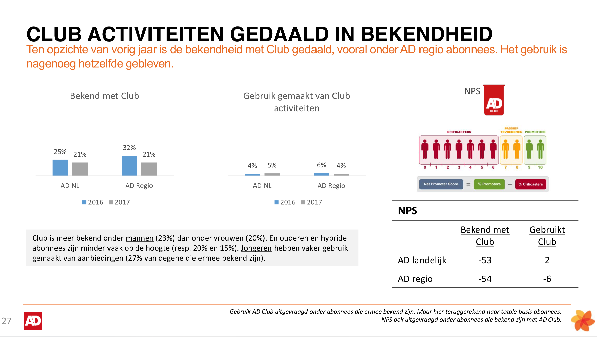

# 2.5 - Doelgroepanalyse

## Doelgroep

Om te weten wie de abonnees zijn van het AD is er informatie opgevraagd rondom dit onderwerp door middel van interne documenten. Op deze manier zijn er zo veel mogelijk inzichten vergaard over wie de AD lezers zijn, en wat hun online ervaringen zijn. De documenten zijn een betrouwbare bron van informatie, omdat het voor De Persgroep een cruciaal aspect is om te weten wie de lezer is. En dus met zorg zijn gemaakt. Het werd al snel duidelijk dat er bij De Persgroep geen persona's zijn gemaakt, maar segmentaties. 

### Segmentatie van doelgroep

Uit analyse van de documenten komen de volgende bevindingen naar voren:

Zo blijkt uit de onderstaande afbeeldingen dat AD abonnees over het algemeen vallen onder het segment Addicts \(Digitale Snackers\), en Fans \(Enthousiaste Traditionelen\). De nadruk ligt meer op vermaak, in tegenstelling tot de experts \(Drukbezette Meningsvormers\), waar er meer verdieping/verrijking is.

Bij de doelgroep vermaak draait het om:

* Brede keuze aan onderwerpen
* Nadruk op empathie
* Meer ruimte voor menselijke verhalen
* Kunnen meepraten met het gesprek van de dag
* Nieuws consumeren is in essentie een leuke bezigheid
* Combineren van lange en korte momenten door de dag
* Zorgt voor ontspanning

### Leeftijd {#leeftijd}

Ondanks dat de abonnees in te delen zijn in segmenten kan de leeftijd variërend zijn. Over het algemeen ligt de leeftijd wat hoger rond een gemiddelde van 59 jaar in 2017 \(volgens documentatie van De Persgroep\).

Uit onderzoek blijkt wel dat het aantal jongeren toeneemt, en het aantal ouderen afneemt.  Over het algemeen zijn de meeste abonnees al 10+ jaar trouwe abonnee.

Verder zijn er ook nog demografische kenmerken verzameld en inzicht over hun gedrag.

## Kenmerken en interesses doelgroep

## Gedrag van de gebruikers

## Conclusie

Over het algemeen is de doelgroep ouder. Dit betekent dus dat daar rekening mee moet worden gehouden in het ontwerpproces. De oudere doelgroep heeft meer behoefte aan direct bellen, of de fysieke krant lezen, en zal minder gebruik maken van de digitale omgevingen of diensten \(denk aan de digitale krant\). Dit blijkt ook uit onderzoek met de [klantenservice](../h3-ideen-en-inzichten/2.8-klantenservice-research.md). Met ouderen wordt bedoeld de 65+'ers.

Maar er zijn ook veel ouderen die wel weer gebruik maken van digitale diensten en producten. Daarom is het van belang dat de online omgeving zo intuïtief mogelijk werkt voor hen, zodat er geen leercurve is en zij niet hoeven te gaan bellen omdat het niet duidelijk werkt. Dit geldt uiteindelijk dus ook voor jongeren. Jongeren betekent bij De Persgroep 18-49 jaar. Dit zijn een groot deel van de gebruikers en worden zeker niet buitengesloten in dit project. Het doel is om iedereen zo goed en duidelijk mogelijk te helpen.

Omdat de klantenzorg van het AD voor iedereen beschikbaar moet zijn is het lastig om tot een specifieke doelgroep te komen. Om deze reden is er gekozen voor het opstellen van Jobs to be done in combinatie met Job stories.

Bekijk de persona's



Zie de Job to be Done met bijbehorende job stories voor de taken die de gebruiker wilt uitvoeren.



