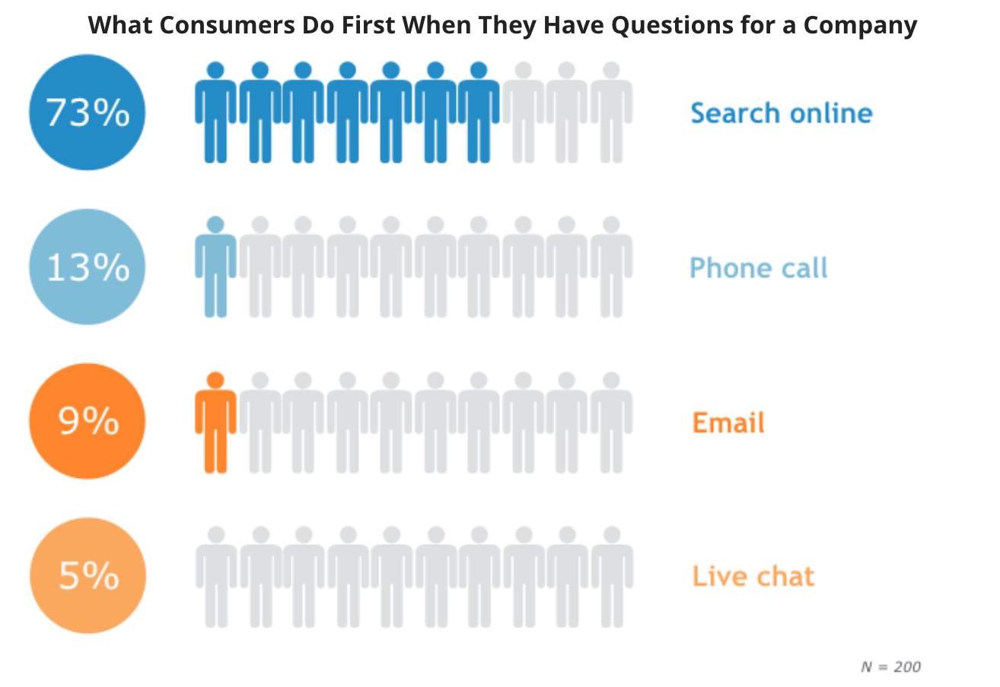
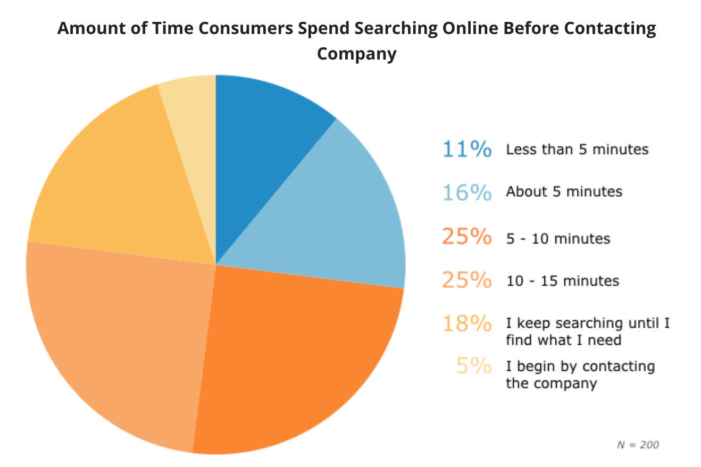

# 2.9 - Self-service onderzoek

## Inleiding

Een belangrijk aspect dat ik wilde onderzoeken is de invloed van self-service. Na het bedenken van enkele concepten werd de conclusie getrokken dat deze ideeën de gebruiker niet voldoende helpt en hen geen betere klantenzorg geeft. Het kwam naar voren dat men zelf zaken wilt regelen, en het AD wilt hen het liefst online zo goed mogelijk helpen.

Aan de hand van dit onderzoek wordt duidelijk wat voor rol self-service kan spelen en wat voor invloed dat heeft op het product.

## Waarom self-service

Hoe makkelijker het voor onze gebruiker is om zichzelf te helpen, hoe lager het aantal telefoontjes zal zijn, hoe meer geld er bespaart wordt, en hoe meer tijd er over blijft om de service te optimaliseren.

Maar de echte reden dat self-service zo goed werkt, is omdat het vertrouwen opbouwt tussen merk en klant. Aldus Kelly O'Brien via Kayako \(O'Brien, 2015\) [`[19]`](../literatuurlijst.md).

\(Borowski, z.d.\) [`[20]`](../literatuurlijst.md) concludeert dat driekwart van de gebruikers met een vraag eerst zelf online naar antwoorden zoeken. Dit wordt ook aangetoont in de volgende afbeelding

Het feit dat zo veel gebruikers eindigen met bellen, emailen, of chatten betekent waarschijnlijk dat zij onsuccesvol waren in het bereiken van hun doel. Hier gaan veel bedrijven met hun service de verkeerde kant op. Veel bedrijven eindigen met slechte UX omtrent het topic van service. Het wordt een raadsel voor de gebruiker hoe zij iets moeten vinden, wijzigen of oplossen. 

Een goede oplossing is het verbeteren van de gebruiksvriendelijkheid van de self-service onderdelen. verbeteringen op basis van wat de gebruiker nu echt wilt, en wat zijn gedrag is. Het is veel beter om precies te weten wat de gebruiker wilt, dan het te gokken en een foute oplossing bieden.

Daarnaast is bekend dat veel gebruikers het al op geven na ongeveer 5 minuten. Hen binnen die tijd dienen met de juiste content is dus van groot belang.

## 4 redenen dat gebruikers falen

Er zijn paar basis regels als het aankomt op self-service.  
Gebruikers zullen falen wanneer zij:

* Niet heldere antwoorden kunnen vinden voordat hun geduld opraakt
* Een of meerdere antwoorden vinden die gedeeltelijk hun antwoord oplost
* Een antwoord vinden dat meer vragen oplevert
* Het ontdekken van conflicterende, onduidelijke informatie

## Laat zien dat je weet wat ze nodig hebben.

De eerste taak is om in je gebruik zijn hoofd te komen. Je hebt kennis nodig over wie je gebruiker is en hoe zij je product en service gebruiken.

Ook het klantenservice team heeft veel ervaring met de doelgroep en heeft informatie over waar het fout gaat.

## Toon aan dat je hun tijd waardeert

De volgende prioriteit is het zo eenvoudig en snel mogelijk maken voor je gebruiker om antwoorden te vinden die zij zoeken. \(O'Brien, 2015\) [`[19]`](../literatuurlijst.md). Het is belangrijk om te kijken naar de volgende aspecten:

* Is de service pagina makkelijk navigeerbaar?
* Is de zoekbalk prominent, krachtig en doeltreffend?
* Hoe zit het met de content van de data base?

## Toon aan dat je de gebruiker begrijpt en weet hoe zij zich voelen

Tot slot is het opbouwen van vertrouwen door middel van self-service een hele aanpak. De content moet empathiek uitstralen. Een groot deel hangt af van de tone of voice. Behandel de gebruiker als mens. \(O'Brien, 2015\) [`[19]`](../literatuurlijst.md)

