# 2.8 - Concurrentie analyse

## Nieuwssite concurrenten

Om er achter te komen hoe andere nieuwsmerken omgaan met de klantenzorg zijn de volgende sites bezocht en geanalyseerd.

### NRC

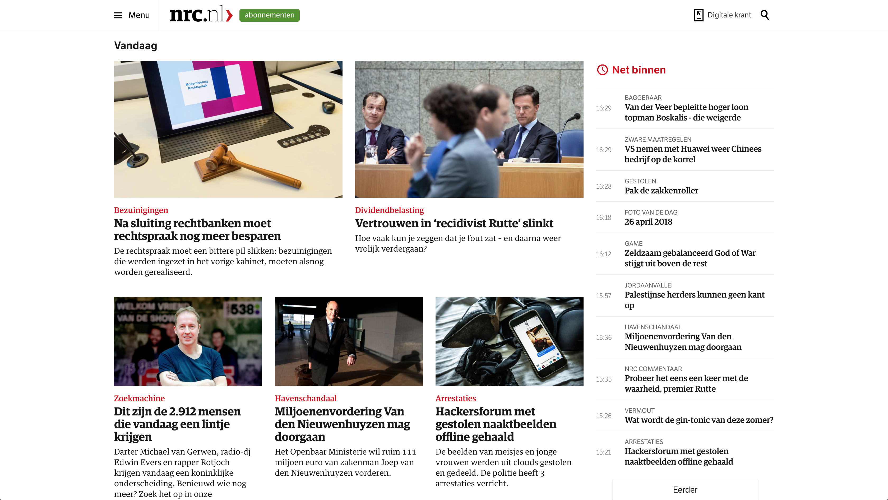

Opvallend is dat het NRC gebruikt maakt van een hamburgermenu waaronder alle items vallen. De gehele uitstraling van de site is een stuk rustiger dan het AD.

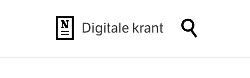

Het NRC maakt over het algemeen meer gebruik van iconen. De digitale krant wordt op deze manier ook aangegeven.

### Volkskrants

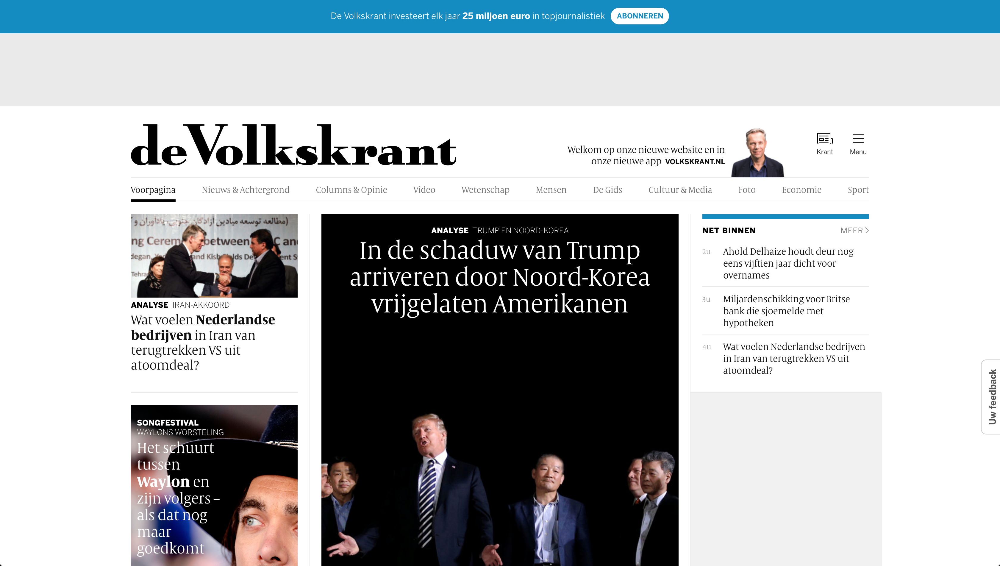

Ook de Volkskrant maakt gebruik van een hamburg menu. Deze keer aan de rechterkant te vinden. Hier onder zijn vervolgens ook weer alle items te vinden.

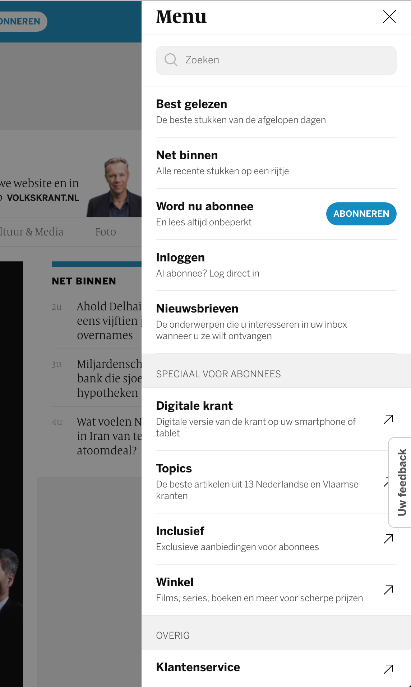

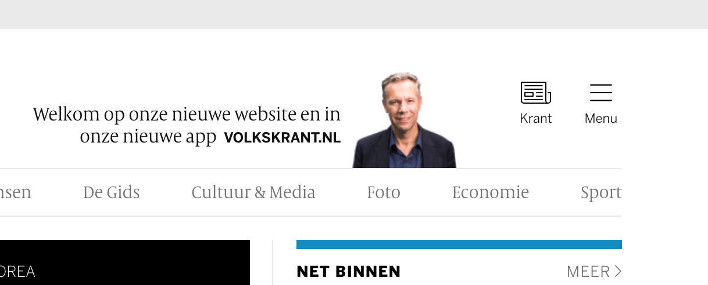

Opvallend is het icoon met de krant dat de digitale krant representateert.

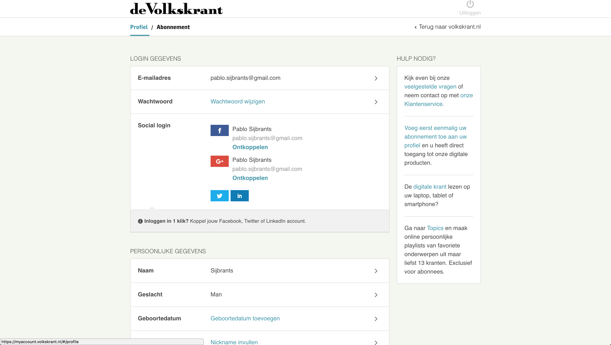

De volkskrant hanteert dezelfde layout als het ad en trouw. Met kleine verschillen als een / teken tussen 'profiel' en 'abonnement'. Ook staat aan de rechter kant meer opties wanneer er hulp nodig is. Het is de vraag waarom dat bij de volkskrant wel staat, maar niet bij het AD.

Het kan te maken hebben met een andere segment lezers. Dat zij pagina's anders lezen etc.

### Trouw

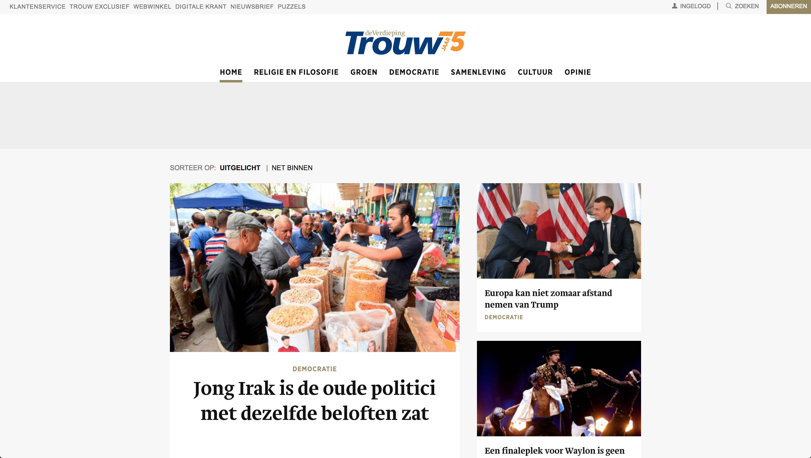

Trouw heeft bovenin een balk over de gehele breedte. Dit komt aardig overeen met het AD, al straalt het hier meer overzichtelijkheid uit. Het account gedeelte is hetzelfde als het AD.nl

### Nieuwsblad.be

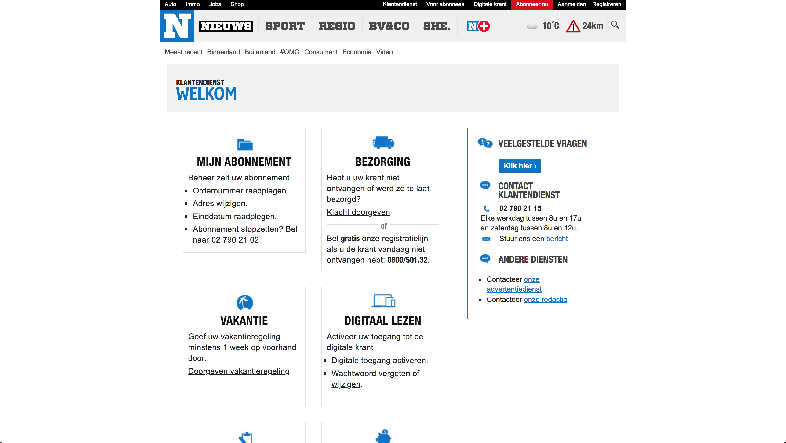

De Belgische nieuwssite is hierarchisch gezien wat minder goed uitgewerkt.

### Nu.nl

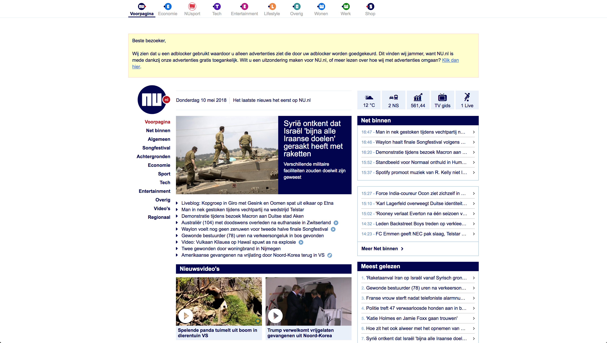

Nu.nl biedt weinig tot geen service. Deze site is duidelijk bedoeld voor alleen het consumeren van \(gratis\) nieuws.

## Account omgeving analyse

In plaats van naar nieuwssites kijken is er een algemene research gedaan naar sites met een account omgeving.

### Mijn CZ

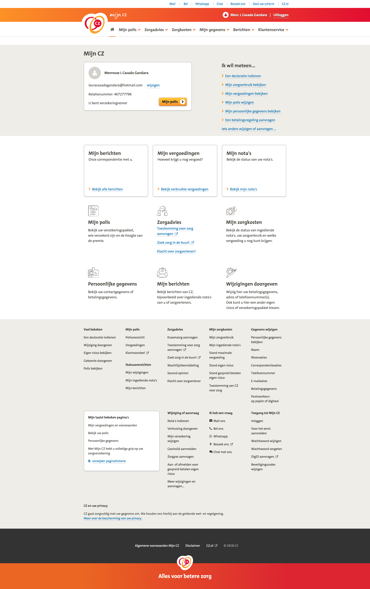

Bij mijn CZ is er een uitgebreide account omgeving waar veel dingen te regelen valt. Opvallend is het bovenste blok waar aan de linkerkant de persoongegevens staat en het klantennummer. Aan de rechterkant staan opties die waarschijnlijk het meest geregeld worden door klanten.

### Zilveren Kruis

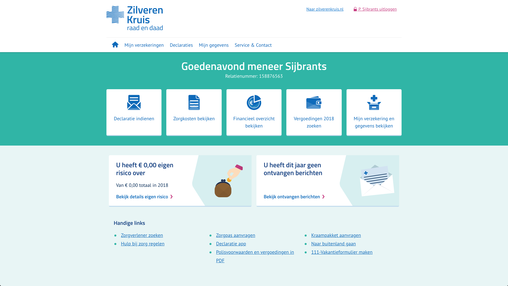

Zilveren kruis account omgeving. Het biedt een overzichtelijke opties en maakt veel gebruik van iconen en visuals. De reeks met horizontale iconen werkt fijn om een snelle selectie te maken.

### Mijn Nuon

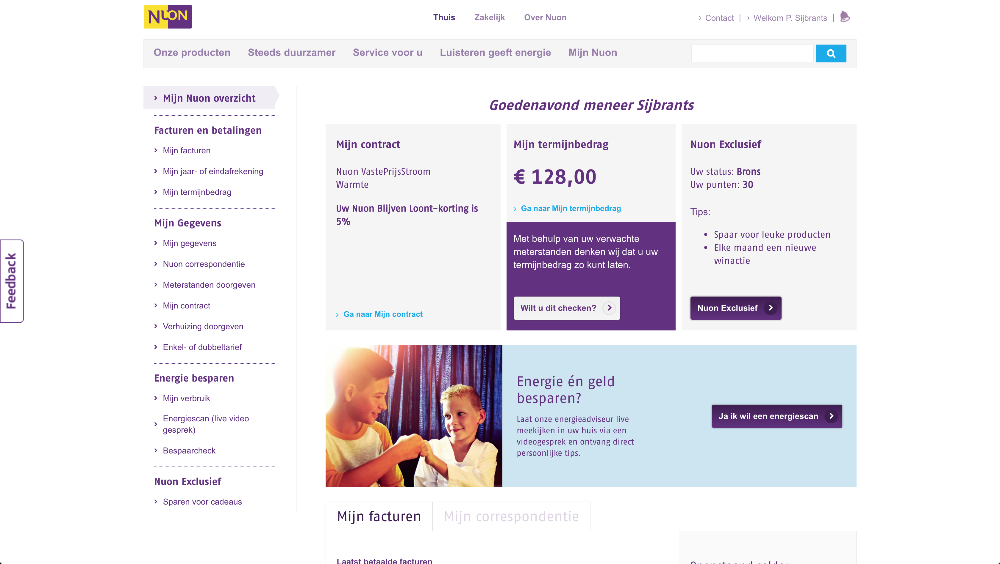

Mijn Nuon heeft een uitgebreide omgeving waar veel zaken bekeken en aangepast kunnen worden. Nuon straalt een warm en sympathiek gevoel uit. Mede door gebruik van afbeeldingen en kleur tonen. Door middel van een side menu met alle opties, kan men eenvoudig vinden waar ze naar op zoek zijn.

### Tele2

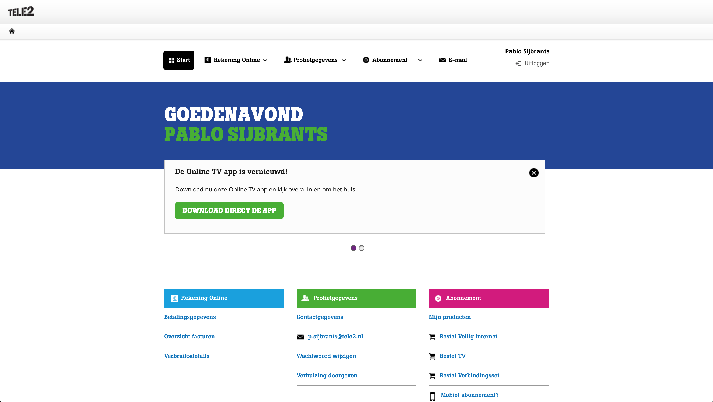

Tele2 gaat meer voor de lijstweergave en komt wat eenvoudiger over. Het somt alle items op die de gebruiker kan kiezen.

