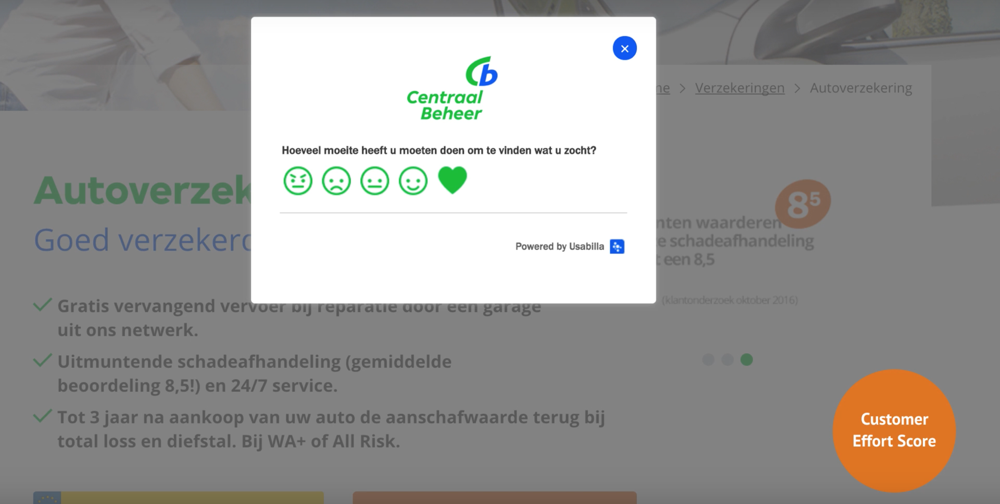

# 2.2 - Content in care fase

## De care fase

Eddy Lindeboom \(Lindeboom, 2017\)[`[21]`](../literatuurlijst.md), conversie optimalisatie consultant, geef advies over hoe een data gedreven online marketeer aan de slag kan gaan om één specifieke fase van de customer journey te verbeteren: de Care fase.

Deze video werd aangeraden door Joshua Kreuger. Hij is een conversie optimalisatie consultant bij De Persgroep.

{% embed data="{\"url\":\"https://www.youtube.com/watch?v=kiH\_SRIzqvY&t=3s\",\"type\":\"video\",\"title\":\"Content in de care fase\",\"description\":\"Eddy Lindeboom, conversie optimalisatie consultant, geef advies over hoe een data gedreven online marketeer aan de slag kan gaan om één specifieke fase van de customer journey te verbeteren: de Care fase.\\n\\nBekijk de slides van conversie optimalisatie specialist Eddy op SlideShare: https://www.slideshare.net/orangevalley/content-in-de-care-fase\\n\\nDownload ook ons whitepaper contentmarketing met een interessante business case en tips voor de contentstrategie: https://goo.gl/GC8FTs\",\"icon\":{\"type\":\"icon\",\"url\":\"https://www.youtube.com/yts/img/favicon\_144-vfliLAfaB.png\",\"width\":144,\"height\":144,\"aspectRatio\":1},\"thumbnail\":{\"type\":\"thumbnail\",\"url\":\"https://i.ytimg.com/vi/kiH\_SRIzqvY/maxresdefault.jpg\",\"width\":1280,\"height\":720,\"aspectRatio\":0.5625},\"embed\":{\"type\":\"player\",\"url\":\"https://www.youtube.com/embed/kiH\_SRIzqvY?rel=0&showinfo=0\",\"html\":\"
<iframe src=\\\"https://www.youtube.com/embed/kiH\_SRIzqvY?rel=0&amp;showinfo=0\\\" style=\\\"border: 0; top: 0; left: 0; width: 100%; height: 100%; position: absolute;\\\" allowfullscreen scrolling=\\\"no\\\"></iframe>
\",\"aspectRatio\":1.7778}}" %}

Na het bekijken van de video is deze samengevat in de volgende punten:

### Wat is service content?

1. Blog omgeving: tips en leuke content. Goede kans om mensen te bereiken. Voor nieuwe klanten, en voor bestaande klanten om ze te betrekken.
2. Na plaatsen bestelling een bevestiging.
3. Persoonlijke berichten helpen het gevoel van de klant te verbeteren.
4. FAQ's.
5. Bij lange tijd inactiviteit. Incentives sturen.

Behouden van de klant = sleutel tot groei.  
**Het is goedkoper om klant te behouden dan tijd er in te steken om hun weer te werven. Meer aandacht geven aan de bestaande klant. Die komen vaker terug en kopen waarschijnlijk iets.**

Het gevoel van zij zijn er voor mij. Niet aan mijn lot overgelaten. Laat de klant van je houden.

### Waarom blijven klanten en waarom gaan zij weg

Volgens de Harvard Business Review, verteld vanuit het perspectief van Orangevalley, blijkt dat service bij de loyaliteit van een klant gedeeltelijk meespeelt. Maar dat slechte service een hele grote reden is dat klanten weg zouden gaan.

## Hoe meet je de kwaliteit van je content/service?

###  1. Customer effort score

Het meten van de moeite die iemand moet doen, om bij een bepaald doel te komen. Hoe minder moeite, hoe blijer de gebruiker, des te grotere kans op een herhaal aankoop.

Hoe kun je dit meten:

Door bijvoorbeeld op je site te vragen hoe de klant zich voelde tijdens het gebruikt. Dit is dus een belangrijke factor om de effort te meten.

Des te minder moeite, des te hoger de kans is op een herhaal aankoop of aanbeveling.

### 

### 2. Usefulness score

Het meten van de kwaliteit van je \(service\) content. Door te vragen: "Was deze informatie nuttig voor u. Ja of nee."

  
Zo blijkt ook dat de lay-out van dit soort blokken erg belangrijk is.

### 3. Deep dive research

Blindspots in de data te dichten. Als er wordt aangegeven dat de FAQ niet goed werkt, waarom is dat dan zo? En wat voor soort content zoeken mensen dan specifiek?

On site surveys: waar loop je tegen aan, wat mis je etc. Neem contact op als je er niet uitkomt.

Samenvatting:

1 content uit de care fase heeft invloed op de gehele customer journey  
2 maak service content meetbaar en breng knelpunten in kaart  
3 monitor key metrics voor service  
4 laat de klant van je houden.

## Conclusie

Door het toevoegen van verschillende elementen op je website kun je achterhalen of een gebruiker tevreden is of niet. Hiermee kun je meten of de service goed is.

