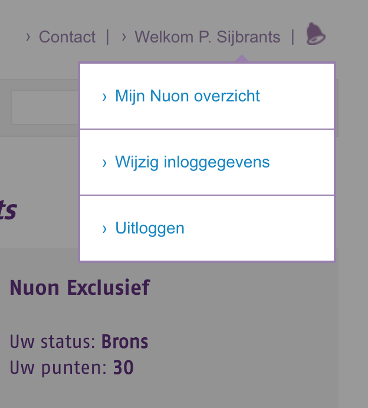
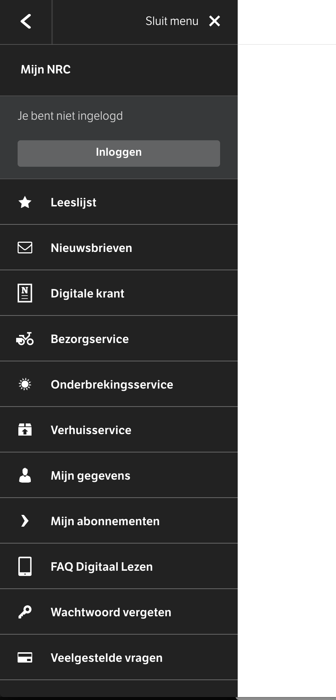
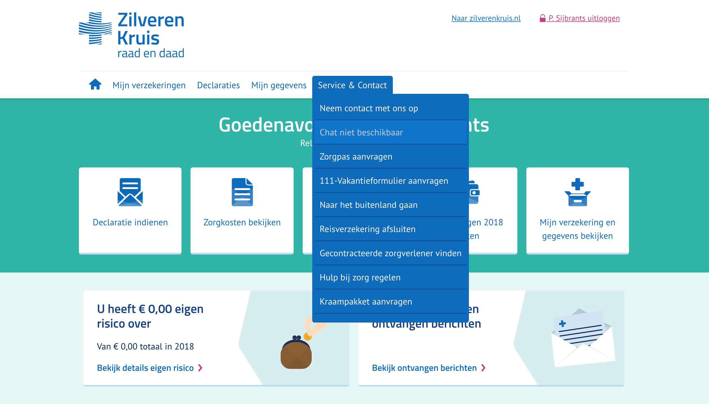
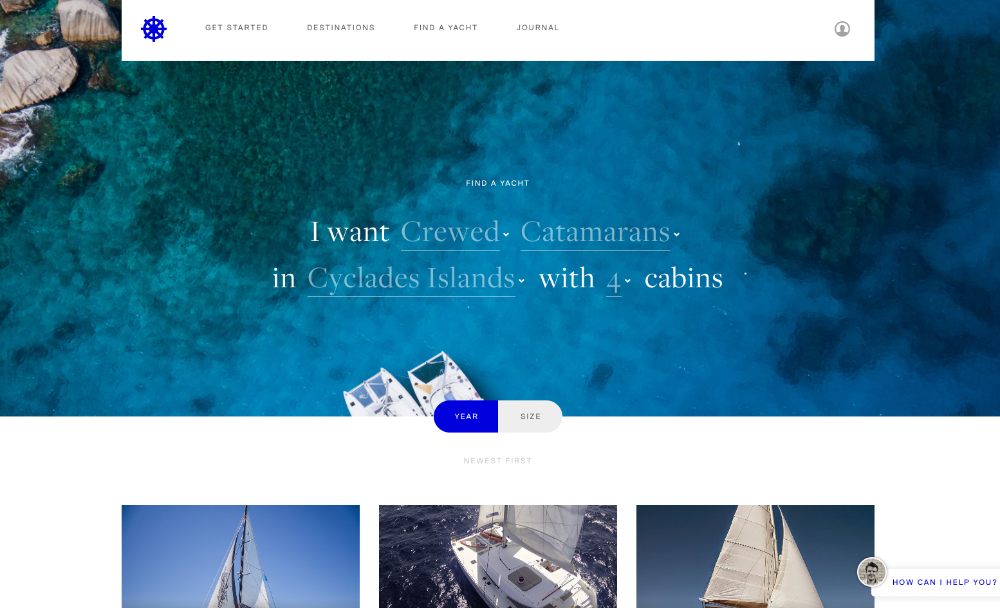
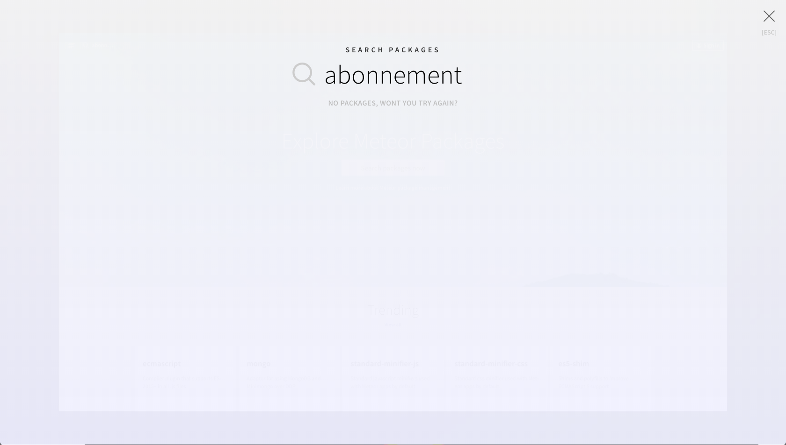

# 2.6 - Design pattern search

## Pattern research

Aan de hand van de concurrentie analyse zijn er enkele patronen gevonden die interessant zijn voor het design proces.

### Menu

### 

### 

### 

### Zoekbalk

### 

### Blok structuur

