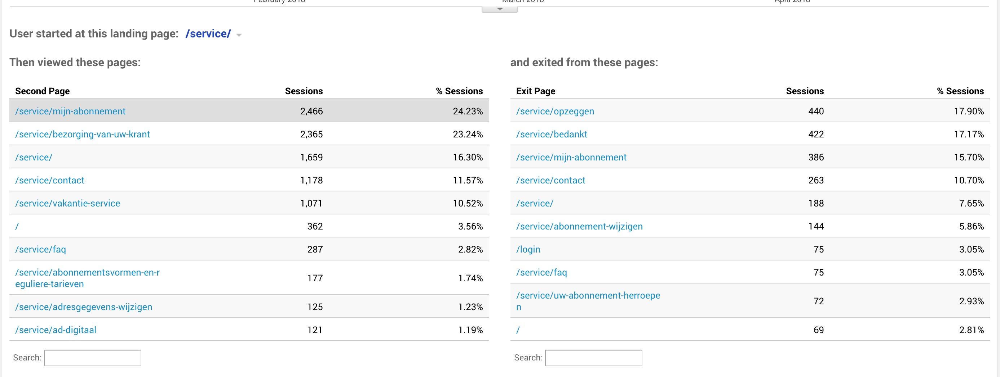

# 2.7 - Online analytics

## Looker

Via het programma Looker is achterhaald hoeveel bezoekers er zijn in 30 dagen tijd. Daarvan is ook inzichtelijk hoeveel mensen er met een vast en een proefabonnement inloggen. Er is te zien dat dit een klein aantal is. Zo een 3% van de totale bezoekers.

## Google Analytics research

Om een indruk te krijgen van het gedrag op de website is er een onderzoek gedaan binnen Google analytics. De nadruk ligt hier vooral in het uitzoeken wat het gedrag is rondom account en service.

In de resultaten zal vaak te zien zijn dat er 2 varianten zijn zoals bijvoorbeeld /myaccount/profile en /profile. Dit zijn uiteindelijk dezelfde pagina's. Er kon niet achterhaald worden waarom dit twee verschillende benamingen had.

### Meest bezochte account pagina's

{% embed data="{\"url\":\"https://drive.google.com/open?id=1usMwHx4GGHwdOOa1FuWbgjNG7LaiGBVy\",\"type\":\"rich\",\"title\":\"All users > meest bezochte profile pagina.pdf\",\"icon\":{\"type\":\"icon\",\"url\":\"https://ssl.gstatic.com/docs/doclist/images/icon\_14\_pdf\_favicon.ico\",\"aspectRatio\":0},\"thumbnail\":{\"type\":\"thumbnail\",\"url\":\"https://lh3.googleusercontent.com/L7QeWXfT3AHBgSXjqu\_IQ44QuHKPbap0izLSXhZQefOm6jdZtifbPg53NDQ=w1200-h630-p\",\"width\":1200,\"height\":630,\"aspectRatio\":0.525},\"embed\":{\"type\":\"reader\",\"url\":\"https://drive.google.com/file/d/1usMwHx4GGHwdOOa1FuWbgjNG7LaiGBVy/preview?usp=embed\_googleplus\",\"html\":\"
<iframe src=\\\"https://drive.google.com/file/d/1usMwHx4GGHwdOOa1FuWbgjNG7LaiGBVy/preview?usp=embed\_googleplus\\\" style=\\\"border: 0; top: 0; left: 0; width: 100%; height: 100%; position: absolute;\\\" allowfullscreen></iframe>
\",\"aspectRatio\":0.7071}}" %}

Van alle bezoekers zijn dit de meest bezochte pagina's in de account omgeving. Te zien is dat 'subscription' \(abonnement\) het meest bezocht wordt, gevolgd door 'complaints' \(klachten\).

### Meest bezochte service pagina's

{% embed data="{\"url\":\"https://drive.google.com/open?id=1ERKNM5reKWkVkGBrBjtbRst7UuE081dr\",\"type\":\"rich\",\"title\":\"All users > meest bezochte service pagina.pdf\",\"icon\":{\"type\":\"icon\",\"url\":\"https://ssl.gstatic.com/docs/doclist/images/icon\_14\_pdf\_favicon.ico\",\"aspectRatio\":0},\"thumbnail\":{\"type\":\"thumbnail\",\"url\":\"https://lh3.googleusercontent.com/dTrl1hWQjw1zyST5WlD8grXZ26TcesPnvezVzdPhf8-jqKfGUA3lhAktgoY=w1200-h630-p\",\"width\":1200,\"height\":630,\"aspectRatio\":0.525},\"embed\":{\"type\":\"reader\",\"url\":\"https://drive.google.com/file/d/1ERKNM5reKWkVkGBrBjtbRst7UuE081dr/preview?usp=embed\_googleplus\",\"html\":\"
<iframe src=\\\"https://drive.google.com/file/d/1ERKNM5reKWkVkGBrBjtbRst7UuE081dr/preview?usp=embed\_googleplus\\\" style=\\\"border: 0; top: 0; left: 0; width: 100%; height: 100%; position: absolute;\\\" allowfullscreen></iframe>
\",\"aspectRatio\":0.7071}}" %}

De eerste regel kan negeert worden. Te zien is dat men vaak naar contact zoekt of naar veelgestelde vragen. Vervolgens is er een duidelijke opsomming aan onderwerpen dat de gebruiker zoekt.

### Profielbezoekers op servicepagina

Er is een segment aangemaakt die inzichtelijk maakt wat gebruikers, die hun profielpagina bezocht hebben, vervolgens doen op de servicepagina.

{% embed data="{\"url\":\"https://drive.google.com/open?id=14jsBF-3utAK-wMkcfPzvuI1LNItXDHdp\",\"type\":\"rich\",\"title\":\"Gebruiker visited profile > visits service.pdf\",\"icon\":{\"type\":\"icon\",\"url\":\"https://ssl.gstatic.com/docs/doclist/images/icon\_14\_pdf\_favicon.ico\",\"aspectRatio\":0},\"thumbnail\":{\"type\":\"thumbnail\",\"url\":\"https://lh3.googleusercontent.com/wPh6MXtO-ywwJSJ9Of0Awp25noefmg5E0Oi5B6iXKsxCkJ8aBOluu5cUG9I=w1200-h630-p\",\"width\":1200,\"height\":630,\"aspectRatio\":0.525},\"embed\":{\"type\":\"reader\",\"url\":\"https://drive.google.com/file/d/14jsBF-3utAK-wMkcfPzvuI1LNItXDHdp/preview?usp=embed\_googleplus\",\"html\":\"
<iframe src=\\\"https://drive.google.com/file/d/14jsBF-3utAK-wMkcfPzvuI1LNItXDHdp/preview?usp=embed\_googleplus\\\" style=\\\"border: 0; top: 0; left: 0; width: 100%; height: 100%; position: absolute;\\\" allowfullscreen></iframe>
\",\"aspectRatio\":0.7071}}" %}

Te zien is dat hier veel gekeken wordt bij de FAQ, gevolgd door de pagina waar je wijzigingen of klachten binnen je abonnement kun doorgeven. Ook contact staat hier weer hoog in de lijst.

Het aantal gebruikers die hun profiel gegarandeerd bezocht hebben is 51,452.  
Het aantal gebruikers dat vervolgens naar de servicepagina gaat is 9,000.  
Hieruit kan geconcludeerd worden dat 9,000/51,452=0,17x100= 17% doorgaat naar de servicepagina.  
Er gaat ook een gedeelte door naar de FAQ pagina zij zijn goed voor 12%.  
  
**Samen is dit 39%. Dit is een aanzienlijk getal. Daaruit kun je concluderen dat men op hun profiel een vraag heeft en dat niet daar kan vinden.**  

### Second page servicepagina

Men die start op de servicepagina gaat vervolgens naar...en exit de pagina via...

### Demografische inzichten

Te zien aan de grafieken gaat het gebruik tussen man en vrouw gelijk op. Qua leeftijd is het interessant om te zien dat er veel jongeren tussen de 25-34 gebruik maken van de site. Ook al wordt altijd aangeven dat het AD over het algemeen een doelgroep heeft van gemiddeld 49. De 65+'ers nemen snel in aantal af, maar zijn nog zeker goed voor zo een 10% van het totale gebruik. Zij maken vooral nog gebruik van de fysieke krant.

Ook is te zien dat het grootste deel van de gebruikers mobiel zijn, gevolgd door desktop en daarna tablet. Dit is interessant om te zien. [Volgens de survey](../h3-ideen-en-inzichten/survey.md#resultaten-enquete) heeft men meer behoefte aan het gebruik van een desktop wanneer het aankomt op het regelen van zaken of het opzoeken van een vraag.

