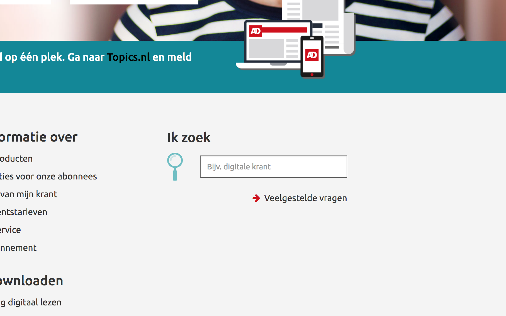
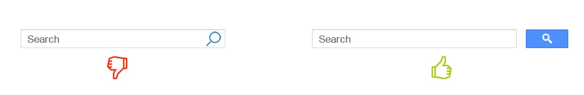
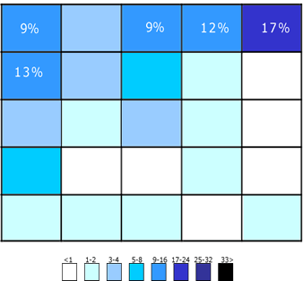
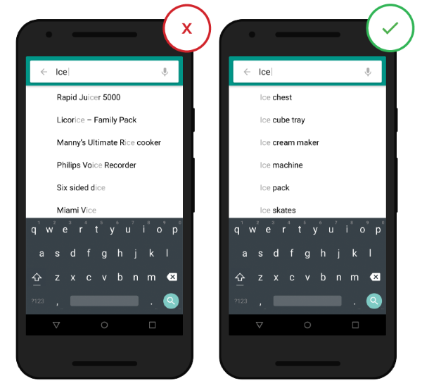

# 2.4 - Zoekbalk onderzoek

## Creëren van een goede zoekbalk

Uit de [usability test](../h3-ideen-en-inzichten/2.2.1-resultaten.md) bleek dat alle testpersonen gebruik maakte van de zoekbalk op de servicepagina. Ook uit de [enquete](../h3-ideen-en-inzichten/survey.md) blijkt dat men de zoekbalk veel gebruikt. In de huidige situatie is deze te vinden op de servicepagina, maar was niet altijd even duidelijk te vinden en lastig in gebruik.

Om die reden is er een onderzoek gedaan naar zoekbalken. En een analyse toegepast op de huidige zoekbalk.

Wat maakt een goede zoekbalk? In 2017 onderzocht Babich [\[11\]](../literatuurlijst.md) hoe je een perfecte zoekbalk maakt. Aan de hand van enkele best practices.

* **Gebruik een verglootglas icoon** Begeleid altijd de zoekbox met het vergrootglaspictogram. Pictogrammen zijn per definitie een visuele weergave van een object, actie of idee. 
* **Geef zoekvelden duidelijk weer** Als zoeken een belangrijke functie is voor je app / site, moet deze prominent worden weergegeven, omdat dit voor gebruikers de snelste manier is om te ontdekken. 
* **Plaats een zoekknop bij het zoekvak** Een knop helpt mensen te herkennen dat er een extra stap is om de zoekactie te activeren - zelfs als ze besluiten dit te doen door op Enter te drukken.

* **Plaats de zoekbalk op elke pagina.** 
* **Maak het zoekvak eenvoudig** Als je een zoekvak ontwerpt, moet je ervoor zorgen dat het er zo uitziet en zo eenvoudig mogelijk te gebruiken is. 
* **Plaats het zoekvak waar gebruikers het verwachten te vinden.** Het is niet goed wanneer gebruikers moeten zoeken naar zoekvakken omdat het niet opvalt en niet gemakkelijk te herkennen is.

* **Proper Field Size** Een goede vuistregel is om een 27-karakter invoerveld te hebben. Dit dekt 90% van de zoekpogingen. 
* **Gebruik auto-suggestion techniek** Met het mechanisme voor automatische suggesties kunnen gebruikers een goede zoekopdracht vinden door te proberen deze te voorspellen op basis van de ingevoerde tekens. Het mechanisme voor automatische suggestie gaat niet over het versnellen van het zoekproces, maar veel meer over het begeleiden van de gebruiker en het helpen bij het construeren van hun zoekopdracht. Typische gebruikers zijn erg slecht in het formuleren van query's: als ze bij de eerste poging geen goede resultaten krijgen, slagen latere zoekpogingen zelden. Sterker nog, ze geven vaak op. Wanneer suggesties voor automatisch aanvullen goed werken, helpen ze de gebruiker om betere zoekopdrachten te formuleren. 
* **Maak duidelijk waar gebruikers naar kunnen zoeken.**

## Methodes voor zoekresultaten

Vervolgens is er onderzoek gedaan naar hoe je het beste de zoekresultaten kunt weergeven. Volgens Babich \(Babich, 2017\) [\[12\]](../literatuurlijst.md) zijn er enkele _best practices_ voor de zoekbalk.

* **Wis de gebruikersvraag niet nadat ze op de knop Zoeken hebben gedrukt**

  Bewaar de originele tekst. Queryherformulering is een cruciale stap in veel informatiereizen.  

* **Geef nauwkeurige en relevante resultaten**

  De eerste resultatenpagina is veel waard. De pagina met zoekresultaten is de primaire focus van de zoekervaring en kan de conversiepercentages van een site bepalen of verlagen. Gebruikers maken doorgaans zeer snel een oordeel over de waarde van een website op basis van de kwaliteit van een of twee sets zoekresultaten.  

* **Gebruik effectieve autosuggest**

  Ondoeltreffende autosuggesties leveren een slechte zoekervaring op. Zorg ervoor dat autosuggest nuttig is. Enkele handige functies zijn onder meer de herkenning van hoofdwoorden, voorspellende tekst en suggesties terwijl de gebruiker tekst invoert.

* **Verbeteren typefouten**

  Typen is foutgevoelig. Als een gebruiker een zoekterm verkeerd typt en je kunt dit detecteren, dan kun je in plaats daarvan resultaten voor de geraden en 'gecorrigeerde' zoekterm weergeven.  

* **Toon het aantal zoekresultaten**

  Geef het aantal beschikbare zoekitems weer, zodat gebruikers kunnen beslissen hoe lang ze door de zoekresultaten willen kijken.  

* **Kies de juiste paginalay-out**

  Een van de uitdagingen bij het weergeven van zoekresultaten is dat verschillende soorten inhoud verschillende lay-outs vereisen. Twee basislay-outs voor weergave zijn lijstweergave en rasterweergave. Vuistregel: Details in lijsten, afbeeldingen in grids.  

* **Geen 'geen resultaten' tonen**

  Iemand op een pagina laten vallen zonder resultaat kan frustrerend zijn. Vooral als ze de zoekopdracht een paar keer hebben geprobeerd. Je moet vermijden dat gebruikers hun eigen einddoelen krijgen te zien als hun zoekopdracht geen overeenkomende resultaat oplevert.

## Conclusie

Een manier om de gebruiker zo efficiënt mogelijk tot zijn doel te laten komen is het gebruik van een zoekbalk. Het idee is om de zoekbalk van van auto-suggestions te voorzien. En niet een auto complete techniek. Het blijkt namelijk dat het de gebruiker beter begeleidt in het formuleren van de zinnen. En het resulteert minder snel in de gebruiker die opgeeft \(Babich, 2017\) [\[11\]](https://pablo-sijbrants.gitbook.io/productbiografie/~/edit/primary/literatuurlijst).

De zoekbalk moet bij binnenkomst gelijk gebruikt kunnen worden. Daarom zal er een vernieuwde zoekbalk moeten komen die deze doelen kan ondersteunen. 

> "Gebruikers maken doorgaans zeer snel een oordeel over de waarde van een website op basis van de kwaliteit van een of twee sets zoekresultaten."

**Als we de huidige zoekbalk analyseren op basis van deze de eerste set bevindingen. Dan scoort het op 4 van de 9 punten goed. Op basis van de tweede set bevindingen scoort het goed op 2 van de 7 punten.**

Dit betekent dat er veel verbetering kan plaatsvinden in de huidige zoekbalk, en daarmee dus de klantenzorg een stukje verbeteren.

