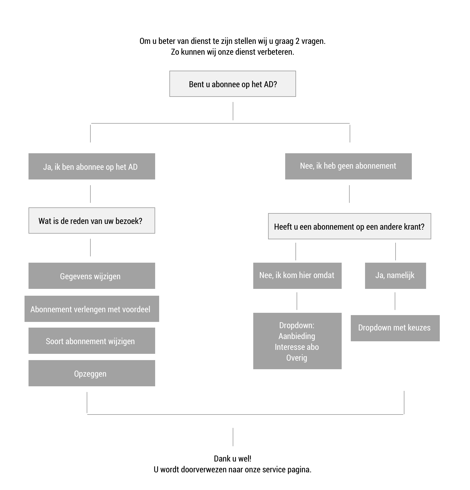
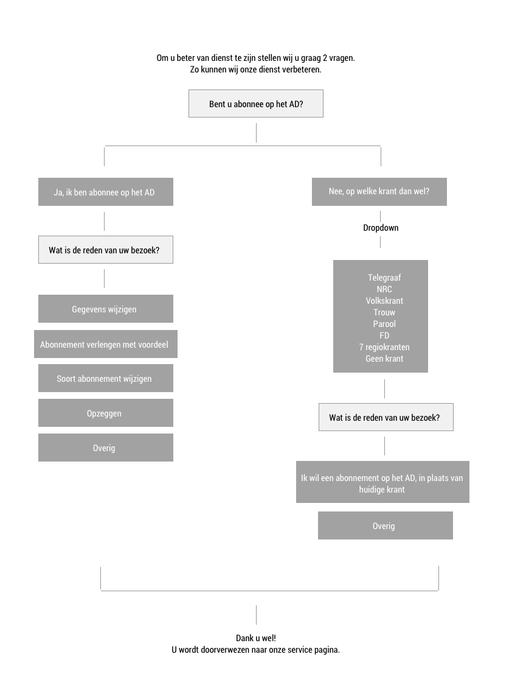
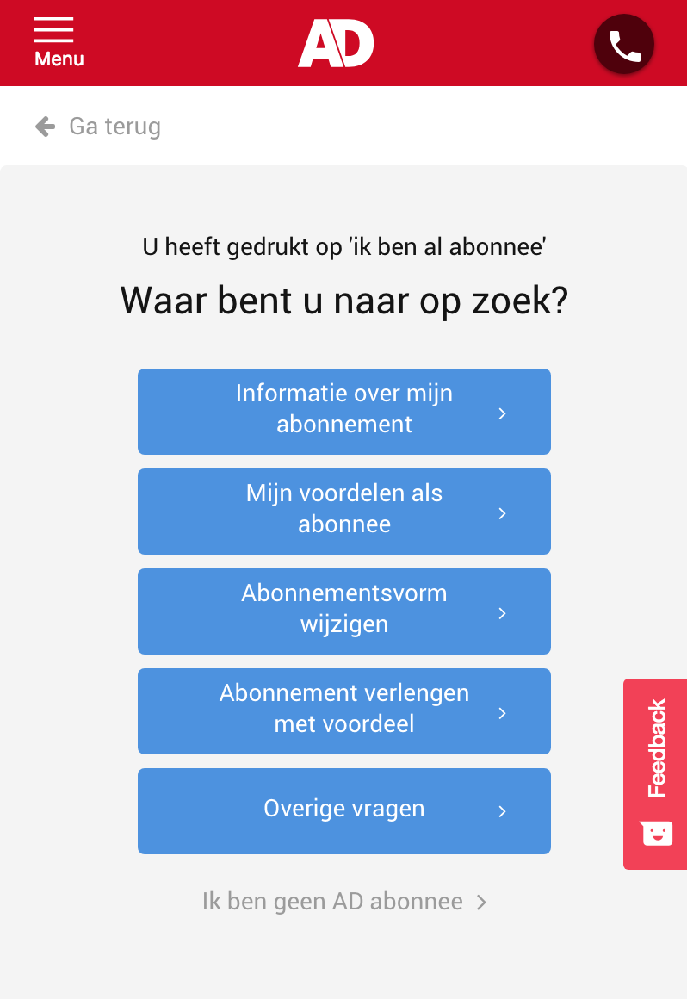
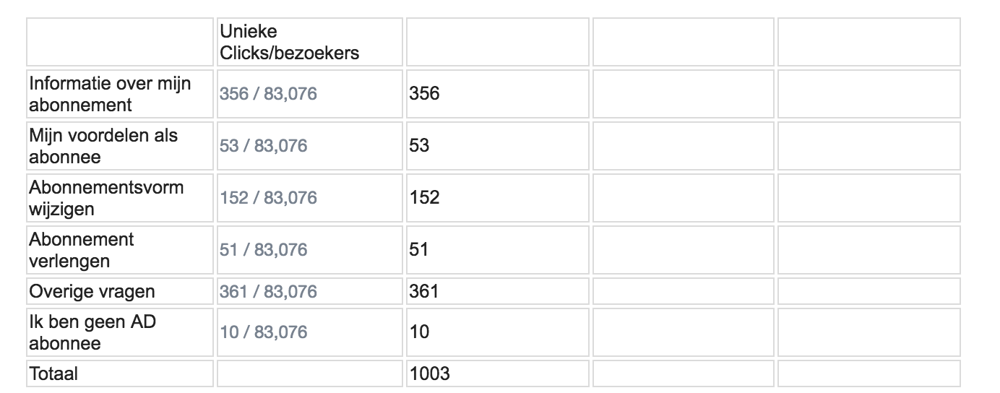

# 2.10 - Tussenscherm "Ik ben al abonnee"

## Doel van onderzoek

Om te achterhalen wat de intentie is van de gebruiker wanneer zij op de "Ik ben al abonnee" knop drukken, op de abonneer pagina. Is er een tussenscherm ontworpen die hier inzicht in moet geven.

Het doel is om op een korte en krachtige manier de gebruiker te leiden naar een juiste pagina. En ondertussen informatie te vergaren over de verwachting van de gebruiker. 


Dit onderzoek is opgezet aan de hand van eerder gestelde doeleinden. Uiteindelijk is de opdracht veranderd en had deze 'Ik ben al abonnee' knop minder waarde in het proces.


## Tussenscherm bouwen

Door middel van het programma VWO \(A/B Testing and Conversion Optimization Platform\) is deze pagina tot stand gekomen. Het heeft 2 maanden geduurd voordat het zo ver was. Dit had te maken door interne omstandigheden. Het was jammer om te zien dat dit proces zo lang duurde.

## Pagina ontwerp

In eerste instantie was het doel om dit onderzoek op zowel het AD als de volkskrant te testen. En de gebruiker door een korte flow heen te leiden. Door een limiet in budget kon uiteindelijk maar een enkel scherm live gezet worden, en voor een titel. Wat dus het AD is geworden.

Er zijn 2 flows gemaakt die duidelijk maken hoe de gebruiker door de flow heen zou gaan. Uiteindelijk is voor flow 2 gekozen. De vragen worden hier beter gesteld, en de flow is logischer om door heen te navigeren bij gebruik.

Het originele ontwerp had meerdere pagina's. Het ontwerp is hieronder te bekijken.

{% embed data="{\"url\":\"https://drive.google.com/open?id=1qCoY5dog9iKbP30IurEK3gzi3wlK--QM\",\"type\":\"rich\",\"title\":\"AD screens old.pdf\",\"icon\":{\"type\":\"icon\",\"url\":\"https://ssl.gstatic.com/docs/doclist/images/icon\_14\_pdf\_favicon.ico\",\"aspectRatio\":0},\"thumbnail\":{\"type\":\"thumbnail\",\"url\":\"https://lh5.googleusercontent.com/0OExjB2puKkUhkaE8cFAPxkMjie19vef\_jj5imqqCcs0kLIQZNlSgHWMKf0=w1200-h630-p\",\"width\":1200,\"height\":630,\"aspectRatio\":0.525},\"embed\":{\"type\":\"reader\",\"url\":\"https://drive.google.com/file/d/1qCoY5dog9iKbP30IurEK3gzi3wlK--QM/preview?usp=embed\_googleplus\",\"html\":\"
<iframe src=\\\"https://drive.google.com/file/d/1qCoY5dog9iKbP30IurEK3gzi3wlK--QM/preview?usp=embed\_googleplus\\\" style=\\\"border: 0; top: 0; left: 0; width: 100%; height: 100%; position: absolute;\\\" allowfullscreen></iframe>
\",\"aspectRatio\":0.7071}}" %}

## Finaal tussenscherm

Uiteindelijk is het scherm er zo uit komen te zien. Waarbij het dus heel minimaal en concreet is gehouden vanwege budget.

## Conclusie

Het valt op dat men naar andere dingen op zoek is dan naar informatie over zijn abonnement. Dit is een interessant inzicht.

