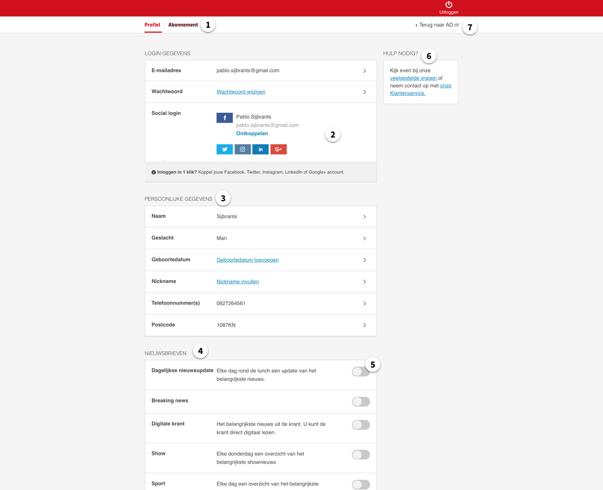

# 3.2 - Usability onderzoek


Deze usability test is toegepast op de huidige situatie van het Algemeen Dagblad.


## Opzetten Usability test

Bij een usabilty test wordt er gekeken naar hoe de gebruiker een pad bewandeld om zijn doel te behalen. Om er achter te komen of er tijdens deze bewandeling knelpunten zijn die de gebruiker ondervindt is er een test opgezet. Met vooraf gestelde doelstellingen wordt er gekeken hoe de testpersoon gebruik maakt van de huidige site van het AD. Tijdens het uitvoeren van de taken zal aan de gebruiker gevraagd worden om hardop na te denken. Op deze manier wordt het duidelijk waar hij aan denkt en naar kijkt. Dit levert vervolgens meer inzichten op.

Om een goed beeld te krijgen van het gedrag van de gebruiker lag de focus op de twee meest voorkomende scenario’s.

- Het gebruik van de inlog en de account omgeving wanneer daar wijzigingen worden doorgevoerd of gezocht wordt naar bepaalde diensten en services.  
- Het gebruik van de servicepagina wanneer er een vraag opgezocht wordt, dat niet te vinden is door zelf te zoeken.

### Doel van de test

Het doel is om erachter te komen hoe gebruikers nu omgaan met de website in de huidige situatie. Hoe zoeken zij, hoe gaan zij om met hun account omgeving en is alles daar te vinden? En hoe gebruiken zij de servicepagina?

### User script

Tijdens de test wordt er een user script overhandigd aan de deelnemer waarin details staan over de test, maar ook de taken die zij moeten uitvoeren. Een user script vraagt de gebruiker goedkeuring om opgenomen te worden. Daarnaast stelt het de gebruiker gerust en weet wat er gaat komen.

[User script](https://drive.google.com/file/d/1vdmLK4DFN-Jjnb0cO2NqCEk71UMXf5jz/view?usp=sharing)

### 

### Software

Tijdens de test is er gebruik gemaakt van het programma Silverback 3. Dit is een gratis programma dat zich focust op gebruikerstesten. Met Silverback is het mogelijk om een schermopname te maken, waarbij stem en gezicht ook worden opgenomen. De opnames worden lokaal opgeslagen en zijn later terug te vinden in een overzicht.

### Onderbouwing benodigde testpersonen

Volgens een artikel van de Nielson Norman Group wordt er aangetoond dat er voor een goede usability test niet meer dan 5 test personen nodig zijn \(Nielsen, 2012\)[`[2]`](../literatuurlijst.md). Het blijkt namelijk dat meer personen niet per se meer problemen identificeren. De kwaliteit van de bevindingen kan ook achteruit gaan. Om deze reden is er gekozen voor 6 testpersonen. Dit zal genoeg inzichten opleveren en een duidelijke indicatie geven van de knelpunten waar men tegen aan loopt.

Op onderstaande afbeelding is te zien dat de de correlatie heel minimaal is. De groene lijn representeert het aantal bevindingen. Dit is gebaseerd op 82 case studies, aldus Nielsen. 

## 

## Resultaten

De opnames zijn achteraf opnieuw bekeken en alles is gedocumenteerd in een bestand. Deze informatie is niet samengevat en puur ter documentatie.

​[Bekijk gedocumenteerde resultaten](https://docs.google.com/document/d/1j_0CJcOtqmgydlGGnI2uKOAOfJomFPw46JPbW1SRku4/edit)​

Vervolgens is er een samenvatting gemaakt van alle bevindingen die opvallend en interessant zijn. Deze inzichten zijn belangrijk in de ondersteuning van het project en het verbeteren van de online omgeving. Door de bevindingen te ordenen kan er een lijst opgesteld worden met punten die vaak terugkomen, en waar dus met aandacht naar gekeken moet worden.  

### Gebruikers

Voor het onderzoek zijn er [6 test personen](2.2.1-resultaten.md#onderbouwing-benodigde-testpersonen) \(zie onderbouwing\) gebruikt. De leeftijd lag dicht tegen elkaar aan met een gemiddelde leeftijd van 57, met 1 uitschieter van 82 jaar oud. Er is gekozen voor wat een oudere leeftijdsgroep omdat het AD veel abonnees heeft van oudere leeftijd. 

Zie onderstaande verwijzing voor meer informatie over de doelgroep.



Onderstaand heeft elke gebruiker een eigen tab. De bevindingen zijn kort en bondig geschreven. Er zijn veel overeenkomsten te zien tussen de knelpunten van de gebruikers.




Leeftijd 54

* Drukt op tab kruisje ipv terug naar ad.
* Kan Club AD niet vinden. Verwacht het op mijn AD
* Kan digi krant niet vinden.
* Moeite met vakantieservice
* Upgraden lukt niet
* Log in icoon niet duidelijk
* Niet duidelijk dat ze al ingelogd is
* Komt vaak bij klantenservice terecht
* Gebruikt zoekbalk &gt; zin typen
* Moeite met zoekbalk vinden
* Nieuwsbrief lastig te vinden
* Topics info niet te vinden
* Opzeggen is moeilijk. Veel tekst.
* Klikt op actieve abonnementen voor meer info \(kan niet\)
* Scrolled voorbij nieuwsbrief om andere opties te zoeken
* Verward webwinkel met producten aanbod.

Geeft service een 3




Leeftijd 59

* Inlog niet duidelijk
* Denkt dat digi krant zijn artikelen
* Moeite met digi krant vinden.
* Mist mijn account knop
* Wilt geen nieuwsbrief email. Maar online.
* Scrolled voorbij nieuwsbrieven.
* Makkelijk abo tab te vinden.
* Services overbodig voor type abo \(druk beeld\)
* Hulp nodig is knop
* Kan upgrade niet vinden
* Geen zin in klantenservice
* Wilt zelf kunnen regelen
* klantenservice = wat kunnen wij beantwoorden?
* Opzeggen redelijk snel gevonden via servicepagina.
* Gevoel terug bij af na zoeken. Weinig visueel onderscheidt
* Mist reasoning bij opzeggen
* AD club relatief snel gevonden. Te klein. In Mijn Ad.
* Mist info over stopzetten van krant. Wat gebeurt er?
* Kan topics niet vinden. Klikt op digi krant.
* Profiel afstemmen op type abo
* Voelt zich niet geholpen in account omgeving

Features:

* Wilt geselecteerde artikelen

Geeft service een 6




Leeftijd 57

* Geen idee hoe in te loggen
* Heeft zelf digi krant, door patroon snel te vinden. Kan beter.
* Nieuwsbrief instellen niet te vinden. Gebruikt servicepagina
* Gebruikt zoekbalk. &gt; korte woorden
* Ziet tabjes niet in mijn ad.
* Zoekt actieve abonnement onder abonneren.
* Verwacht een kop ‘ik ben al abonnee’
* Gebruikt artikel zoekbalk
* Zou bellen bij upgrade, omdat het moeilijk is.
* Verwarring Club ad en webwinkel
* Moeite met opzeggen vinden. Kijkt bij veelgestelde vragen
* Zou contactformulier invullen
* Vakantieservice vinden via servicepagina.
* Scrolled voorbij nieuwsbrieven.
* Hulp nodig is knop
* Gewend om via klantenservice probleem opgelost te krijgen
* terug naar [ad.nl](http://ad.nl) links ipv rechts

Features:

* Wilt een tutorial mail/pop up

Geeft service een 7.5




Leeftijd 82

* Log in icoon duidelijk. Maar zag het niet
* Digitale krant niet te vinden. Te klein. Lijkt bij takenbalk te horen
* Moeite met nieuwsbrief vinden
* Verwacht ‘in’ een nieuwsbrief te kunnen
* Kan abonnement niet vinden
* Tabje niet te zien in mijn ad
* Zoekbalk lastig te vinden in servicepagina
* Vergeet met enter te bevestigen.
* Gevoel van terug bij af na zoeken. Weinig visueel onderscheidt
* Zou bellen
* Verwacht wel andere leeftijdgenoten die chatten
* Veel tekst bij opzeggen
* Opzeggen kost moeite
* Kan servicepagina knop niet vinden op homepagina
* Pakket upgrade lukt bijna niet.
* Kost moeite om FAQ te scannen
* Weet niet waar abonnee nummer te vinden is.
* Club ad verwacht onder mijn AD
* Zou bellen over vakantieservice
* Hierarchie onduidelijk
* Omgeving voelt onvertrouwd op dit moment. Mist sympathiek. Look and feel belangrijk.

Geeft service een 7




Leeftijd 56

* Drukt gelijk op inlog poppetje
* Ingelogde state niet duidelijk
* Verschil artikelen digi krant niet duidelijk
* Ziet niet digi krant knop
* Wilt zich aanmelden voor nieuwsbrief
* Verwacht nieuwsbrief onder account.
* Scrolled voorbij nieuwsbrief voor meer opties
* Ziet tabje abo niet.
* Gaat naar klantenservice en scant kopjes.
* Gebruikt zoekbalk &gt; trefwoorden &gt; geen results
* Zou bellen, niet chatten
* Ondervindt frustratie met zoeken
* Terug naar [ad.nl](http://ad.nl) links ipv rechts
* Is visueel ingesteld
* Abonnement upgraden kost veel moeite
* Niet door dat ze kan scrollen op juiste pagina.
* Zou formulier invullen
* Moeite met vakantieservice vinden. Via servicepagina gevonden.
* Webwinkel en club ad verwarrend
* Zou club ad en webwinkel onder mijn profiel verwerken.
* Krijgt dan meer klant gevoel
* Niet te vaak de omgeving veranderen = verwarrend
* Gebruikt zoekbalk op home &gt; topics zoeken &gt; vind niks, vind het wel prima

Geeft service een 7




Leeftijd 58

* Gaat gelijk naar inlog icoon
* Verwarring digi krant en artikelen.
* Gebruikt zoekbalk op home &gt; digi krant
* Verwacht dropdown op inlog icoon
* Moeite met nieuwsbrief instellen
* Abo tabje redelijk snel gevonden
* Upgraden &gt; drukt op abo nr koppelen.
* Scant kopjes op service pagina. Veel zoeken
* Staat nergens vermeld dat je kunt upgraden
* Omslachtig om formulier in te vullen
* Optie in Mijn ad dat je kunt upgrade
* Opzeggen &gt; mijn ad &gt; abo &gt; veelgestelde vragen &gt; scannen &gt; abo herroepen &gt; komt er niet uit
* Zou chatten of mail.
* Wilt opzeg knop duidelijker. Goed merk is blij met jou als klant, maar ze moeten het niet moeilijk maken om weg te gaan.
* Ad club lastig te vinden.
* Verwacht club ad onder account.
* Vakantie service snel gevonden &gt; nadat hij patroon wist.
* Meer info over wat vakantieservice inhoudt
* Kan topics niet vinden. Zou contact opnemen.
* Op servicepagina de homeknop &gt; werkt niet
* Mist diensten in profiel
* Zou nu bellen/mailen &gt; bij optimalisatie zou hij profiel wel gebruiken.

Geeft service een 6.5



### Analyse

Uit het gebruikersonderzoek zijn de volgende statistieken gekomen. 

| **Homepagina** |  |
| --- | --- | --- | --- | --- |
| 1 | 85% van de participanten zag de inlog knop over het hoofd. |
| 2 | 85% heeft moeite met de digitale krant te vinden. |
| 3 | 85% heeft moeite met Club AD te vinden. |
| 4 | 35% maakt gebruik van de zoekbalk met de intentie om een functie of service te zoeken. |

| **Account pagina** |  |
| --- | --- | --- | --- | --- | --- | --- | --- | --- |
| 1 | 85% had moeite met de tabs te zien. Waardoor veel informatie niet gevonden kan worden tijdens het bezoek. |
| 2 | De login gegevens waren goed te zien, maar vaak onnodig. 50% gaf aan geen interesse te hebben om met social media in te loggen. 17% gaf aan dat dit hele blok afleidend werkt. |
| 3 | De persoonlijke gegevens worden ook makkelijk herkent door alle participanten. |
| 4 | De nieuwsbrieven zijn voor 70% niet te vinden. 100% ondervindt moeite met deze functie vinden. |
| 5 | De toggle knop werd door 35% gezien als een knop die gesleept moest worden. 17% verwachte bij het klikken 'er in' te gaan en content te kunnen lezen. |
| 6 | Het blok 'Hulp nodig?' was door vrijwel 100% van de participanten duidelijk te vinden. Echter 70% drukte echter op de titel 'Hulp nodig?' en had niet door dat dit dus tekst is. Daarnaast drukte 50% op veelgestelde vragen, de andere helft drukt op klantenservice. |
| 7 | 70% verwacht deze knop aan de andere kant van het scherm. 17% had moeite om weer uit deze omgeving te komen.  |
| Overig | 85% van de participanten scrolt voorbij de nieuwsbrief lijst, om daar andere opties te vinden. |

| **Abonnement pagina** |  |
| --- | --- | --- | --- | --- |
| 1 | De 3 blokken worden over het algemeen wel gezien. 17% gaf aan de tekst raar te vinden bij de vakantieservice. 85% van de gebruikers komt uiteindelijk bij 1 van deze 3 blokken uit via de servicepagina. |
| 2 | 85% denkt dat hier op gedrukt kan worden. |
| 3 | 70% wilt bij het upgraden van zijn abo dat regelen via deze knop |
| 4 | 50% heeft niet door dat zij op een ander tablad zitten. De andere participanten beginnen een patroon te zien. |

| **Vakantieservice** |  |
| --- | --- | --- | --- |
| 1 | De textuele highlights vallen als eerste op.  |
| 2 | 17% wilt hier kijken wat abonnement koppelen is. |
| 3 | 100% geeft aan het waarschijnlijk te snappen als dit veld wel te gebruiken was. |

| **Servicepagina** |  |
| --- | --- | --- | --- | --- | --- | --- | --- |
| 1 | 100% van de participanten ziet de 3 grote blokken bovenaan. Slechts 35% maakt hier gebruik van bij het gene wat zij zoeken. Op een vervolg pagina wordt er wel eerder op deze blokken gedrukt. |
| 2 | Slechts 17% viel deze balk op over informatie over Topics. |
| 3 | 50% scant de kopjes eerst en maakt vervolgens gebruik van de zoekbalk. 50% maakt direct gebruik van de zoekbalk. |
| 4 | De zoekbalk wordt gevarieerd gebruikt. 50% typt hier trefwoorden in. 50% typt hier volledige zinnen. 70% van de gebruikers kreeg onbruikbare resultaten te zien. 50% van de gebruikers had niet door dat er met enter bevestigt moest worden en miste een zoek kn |
| 5 | Geen van de participanten keek naar deze filmpjes. Dit had waarschijnlijk ook te maken met de specifieke taak. |
| 6 | 35% scrolt door na het scannen van de kopjes naar de manieren van contact op te nemen. 70% zou gebruik maken van deze knoppen wanneer het niet lukte met een taak op te lossen |
|  |  |

| **Wijzigen pakket** |  |
| --- | --- |
| Overig | 50% van de participanten komt niet uit bij deze pagina. 70% zegt dit heel omslachtig te vinden. 17% zegt hier geen moeite mee te hebben om dit in te vullen. |

| **Abo wijzigen** |  |
| --- | --- |
| Overig | Wanneer men 1 niveau dieper zit op de servicepagina is er verwarring. De pagina's zijn bijna identiek aan elkaar, maar met andere content. Dit levert over het algemeen verwarring op. |

## Conclusie

* Men kan zich redelijk snel aanpassen aan een patroon. Weet het in de toekomst te vinden. Maar over het algemeen wordt account en service niet actief gebruikt. Dus moet het in een opslag inzichtelijk zijn. Voor zowel de oudere doelgroep als de jongere doelgroep. 
* Er zijn veel pijnpunten bij het stopzetten van de krant of bijvoorbeeld vakantieservice. Doordat het tabje 'abonnement' over het hoofd wordt gezien ontstaat er een lang proces via de servicepagina. 
* Er is veel secundaire informatie prominent aanwezig. Zoals profiel en inlog gegevens. 
* De Hulp nodig knop wordt goed gezien en ook veel gebruikt, omdat men niet even makkelijk kan vinden wat ze zoeken. 
* De informatievoorziening laat ook steken vallen. Bijvoorbeeld wat de vakantieservice dan precies doet. 
* Het upgraden van een abonnement is lastig uit te voeren. En levert frustratie op. 
* Over het algemeen wordt de zoekbalk op de servicepagina actief gebruikt. Er is variatie in het typen; woorden vs zinnen. Met wisselende resultaten; geen resultaat vs hele lijst. 
* Elke gebruiker gaf ook een cijfer aan de huidige service van het AD. Dit is uitgekomen op een gemiddelde van 6,25. 
* Gebruikers geven aan sneller te gaan bellen of mailen dan het te regelen via Mijn AD. Omdat het te veel moeite kost.

