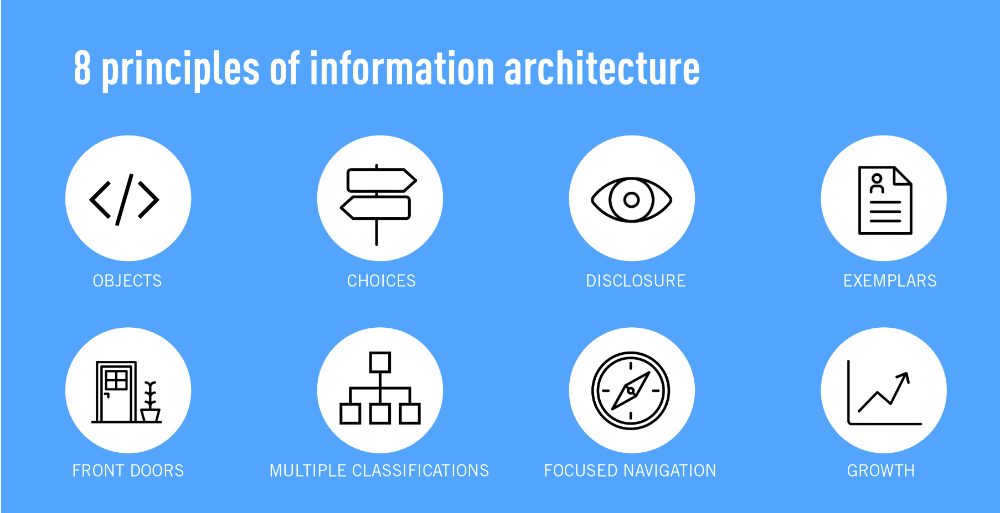
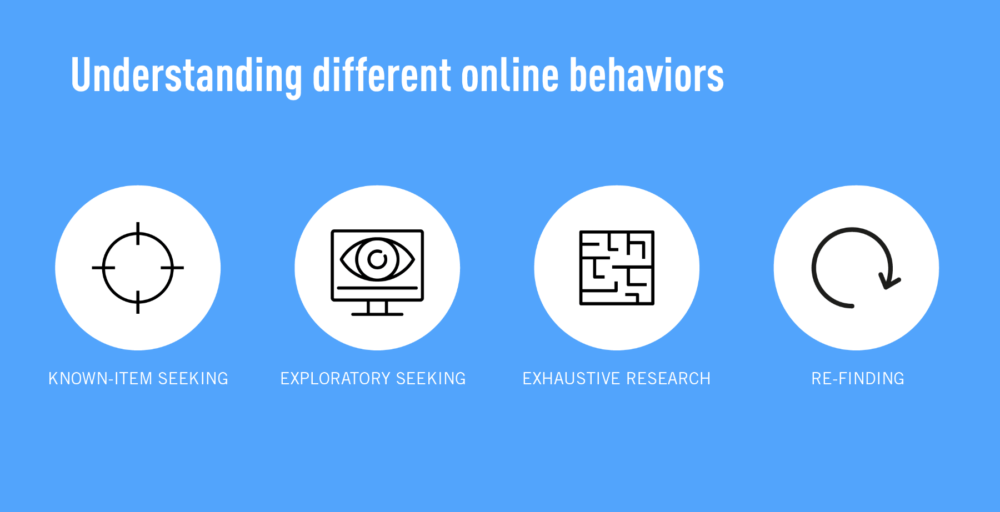

# 3.12 - Informatie architectuur principes

## Inleiding

Wat is Informatie architectuur? Hiermee wordt het creëren van een structuur op een website bedoeld. De informatie dient dusdanig gestructureerd te worden dat gebruikers begrijpen waar ze zich bevinden en wat ze moeten doen \(of waar ze heen moeten\) om hun doel te bereiken \(Winter, 2016\)[`[18]`](../literatuurlijst.md)

Dit is van groot belang in een complexe opdracht als die van mij.

Aan de hand van 8 principes is mijn structuur neergezet en is het ontwerp gerealiseerd.

De volgende lijst is overgenomen van een artikel op career foundry \(Klancar, 2017\)[`[17]`](../literatuurlijst.md), maar geeft inzicht in wat de principes inhouden.

1. **The principle of objects:** Content should be treated as a living, breathing thing. It has lifecycles, behaviors, and attributes.
2. **The principle of choices:** More is less. Keep the number of choices to a minimum.
3. **The principle of disclosure:**Show a preview of information that will help users understand what kind of information is hidden if they dig deeper.
4. **The principle of exemplars:** Show examples of content when describing the content of the categories.
5. **The principle of front doors:** Assume that at least 50% of users will use a different entry point than the home page.
6. **The principle of multiple classifications:** Offer users several different classification schemes to browse the site’s content.
7. **The principle of focused navigation:** Keep navigation simple and never mix different things.
8. **The principle of growth:** Assume that the content on the website will grow. Make sure the website is scalable.

## Hoe verhoudt dit zich tot het ontwerp?

1. Het toepassen van een logische interne structuur en het toepassen van consistent gedrag van alle elementen.
2. Door content op een logische manier te verbergen zal er rust ontstaan op de pagina. De aandacht zal zo op een juiste manier verdeeld worden. De navigatie speelt een grote rol in het minimaliseren van de opties.
3. Door het gebruik van de card pattern geven veel blokken informatie aan over wat er een laag dieper te vinden is.
4. Bijvoorbeeld de Mijn AD knop is een categorie. In die categorie zijn er tal van opties. Via de zijbalk die uitklapt nadat je op Mijn AD drukt worden er voorbeelden gegeven van de content. Dit komt ook terug op de servicepagina.
5. Er zijn verschillende type gebruikers op de site van het AD. Ook al ligt de focus op de bestaande abonnees, je wilt ook niet abonnees helpen die een vraag hebben. Er moeten daarom verschillende ingangen zijn. Zo kan men direct via Mijn AD op andere pagina's uitkomen, maar ook via de knop 'service en contact' dat direct naar de service pagina gaat. Deze knop zou ook op andere pagina's zoals de abonneren pagina etc.
6. Deze principe was lastig toe te passen omdat de context niet goed begrepen werd.
7. De linker verticale navigatie staat centraal op elke pagina en blijft sticky in het scherm staan wanneer men scrolled. De navigatie is op elke content pagina terug te zien. OP deze manier creër je een consistente flow voor de gebruiker.
8. Doordat het ontwerp is voorzien van cards, en leunt op deze pattern, kan het design makkelijk worden uitgebreid. Doordat de content dus bestaat uit blokken kunnen er nieuwe blokken worden geplaatst en zal het design altijd 'heel' blijven. Daarnaast is de content altijd gecentreerd, en gemaakt op een grid.

Volgens het artikel zijn er 4 soorten groepen die elk een ander online gedrag vertonen.

* **Known-item seeking**: Users will come to the website to search for something desirable and known.
* **Exploratory seeking**: Users will come to the website looking for inspiration. They’re looking for something desirable but not sure what exactly.
* **Exhaustive research**: Users are in a process of an extensive research. They want to find as much information as possible.
* **Re-finding:** A user needs a desired items again and are trying to find it.

Wanneer men gebruikt maakt van de website van het AD zullen verschillende types langskomen.

* Known item seeking: Men wilt gebruik maken van zijn diensten zoals AD Club, webwinkel, topics, digitale krant etc. Maar ook wanneer zij een vraag of wijziging hebben willen zij dit kunnen vinden.
* Exploratory seeking: Wanneer men nieuws artikelen scant en op zoek is naar 'leuke', interessante content.
* Re-finding: Bijvoorbeeld een knop of een dienst. In dit geval kan dat zijn account omgeving zijn of hulp en contact.

## Conclusie

Op basis van deze principes zal de content van het product worden georganiseerd en zal het ontwerp ook leunen op deze principes.

