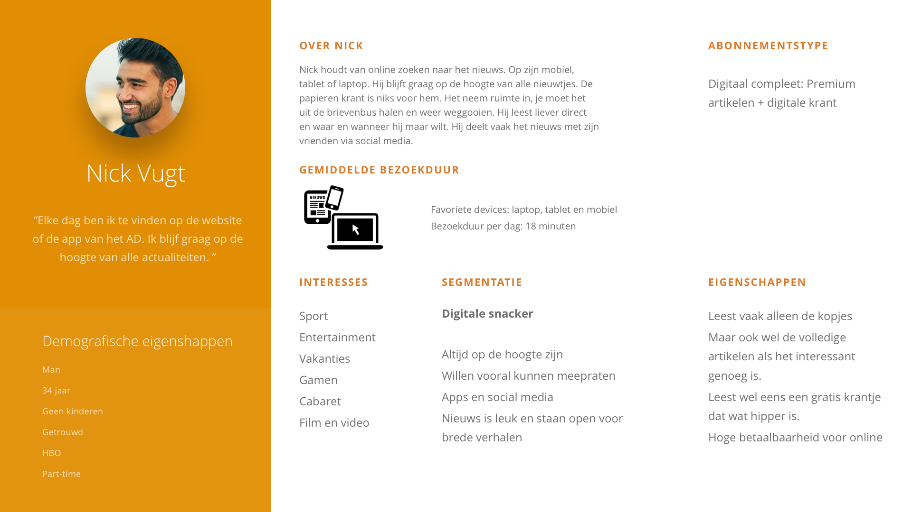

# 3.3 - Persona's

Op basis van de [doelgroepanalyse](../h2-onderzoek/2.1-interne-documenten.md) zijn er meerdere persona's opgesteld. Er zijn namelijk meerdere type users die gebruik maken van de online omgeving op het AD. 

Daarbij is rekening gehouden met de leeftijd van de gebruikers en het type abonnement wat men kan hebben. Dit zijn:  
- Compleet: weekkrant + weekendkrant + digitaal pakket  
- Hybride: weekendkrant + digitaal pakket  
- Digitaal premium: Digitale krant + premium artikelen  
  
Op basis van de persona's worden zo de meeste leeftijdscategorieën, verschillende leesgewoontes en type abonnementen in kaart gebracht.

## Conclusie

De persona's geven een goed inzicht over wat voor soort type gebruikers er op de site komen. Aangezien het een diverse groep is van jong tot oud, met verschillende lees gewoontes en type abonnementen.

Een ding hebben zij wel gemeen, en dat is dat zij allemaal bij vraag, probleem, wijziging of gebruik van een dienst gebruik gaan maken van de account pagina of de service pagina. De demografische en psychische kenmerken spelen in die situatie geen belangrijke rol. Bijvoorbeeld: de gebruiker maakt  gebruik van zijn account om een wijziging door te voeren. Zijn taak hierbij is zijn email adres te veranderen. Niet omdat hij van sport houdt, 2 kinderen heeft en diepgang in artikelen wilt. De gebruiker wilt een taak gedaan krijgen. Om deze reden zijn dan ook Jobs to be Done opgesteld.

