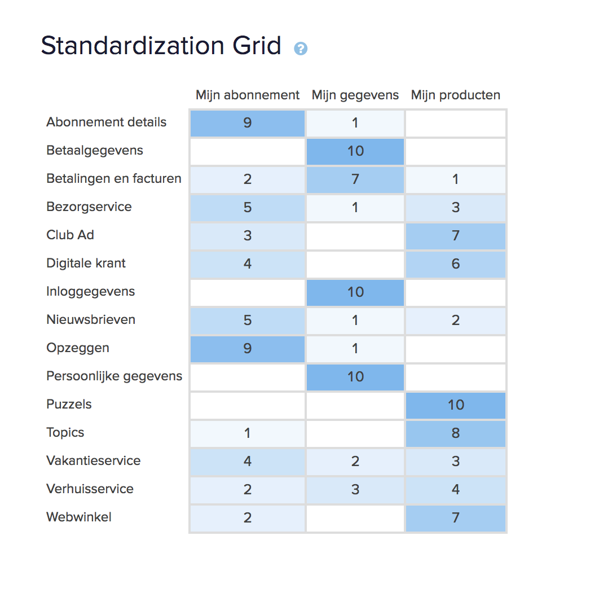

# 3.10 - Card sorting

Om te bepalen hoe de content het beste kan worden ingedeeld in de navigatie, is er een card sorting test opgezet. De gebruiker kan navigatie onderwerpen zelf indelen in categorieën die voor hen logisch lijkt. 

Het is belangrijk om te bepalen waar de content onder wordt gecategoriseerd. Deze test geeft daar inzicht in. Zo weten gebruikers waar ze op intuïtie heen moeten navigeren, wanneer ze een bepaald onderwerp zoeken.

Deze test is opgezet via optimal workshop. Deze site geeft je de mogelijkheid om o.a. een card sorting test toe te passen. De variant van de card sorting was semi closed. Dit betekent dat er al een aantal groepen zijn aangemaakt, maar dat de gebruiker eventueel zelf groepen kan maken. Het was mogelijk om  maximaal 10 participanten deze test te laten doen.

Op basis van alle content op het AD zijn de volgende 3 categorieën tot stand gekomen.

Categorie 1: Mijn abonnement  
Categorie 2: Mijn gegevens  
Categorie 3: Mijn producten

De content die daar bij hoort is af te lezen in de volgende afbeelding.

## Resultaten

Via het Standardization Grid kunnen een aantal zaken worden geconcludeerd:

* Mijn gegevens is de duidelijkste categorie
* Mijn producten wordt over het algemeen ook goed gecategoriseerd.
* Er is verdeeldheid in het categoriseren van de vakantie, bezorg en verhuisservice
* Meerendeel verwacht betalingen en facturen onder Mijn gegevens.

Uit het Similarity Matrix kan worden opgemaakt dat:

* Er bepaalde sets zijn die het beste met elkaar combineren.
* Dat nieuwsbrieven veel gecombineerd wordt met vakantieservice en opzeggen.
* Dat de voordelen/diensten over het algemeen gebundeld worden
* Dit geldt ook voor de inlog, persoonlijke en betaalgegevens.

Op basis van deze resultaten zal de content worden ingedeeld. Dit is te vinden in Hoofdstuk 4 - Product ontwikkeling.

