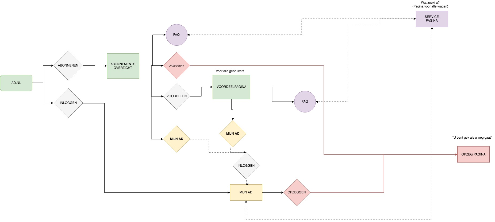
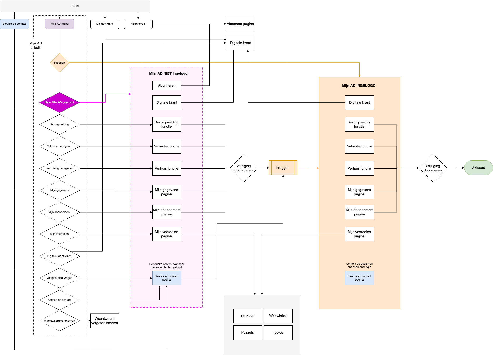

# 3.11 - Flowcharts

## Flowchart op basis van eerste scenario

Op basis van hoe de opdracht in het begin begrepen werd was er een flowchart gemaakt die duidelijk maakte hoe de nieuwe pagina's verbonden zouden worden. Hier lag de focus op het behouden van de abonnees en hen zo goed mogelijk voorzien van informatie en dienen. Er was het idee om een voordeelpagina te ontwerpen voor zowel bestaande als niet bestaande abonnees. Ook wanneer zij wilde opzeggen moest er een speciale omgeving komen. Tot slot was het de bedoeling om te kijken waar de gebruikers zouden binnen komen, en meer touchpoints aan te bieden die hen verwijzen naar de 'Mijn AD'/account omgeving.

## Flowchart op basis van Mijn AD concept

Op basis van onderzoek naar de principes van Informatie architectuur is er een diagram gemaakt die de content structureert. Belangrijk hierbij is dat men in de Mijn AD omgeving kan komen door zowel ingelogd als niet ingelogd te zijn. Dit is af te lezen in de chart. Omdat het product focust op self-service. Zijn de elementen die de gebruiker kan uitvoeren allemaal behandeld. De details binnen een pagina zelf zijn niet in acht genomen. 

Aan de hand van deze chart is te zien via welke ingangen de gebruiker kan komen bij zijn doel. Ook al lijkt de diagram heel complex, toch zit er een heldere structuur en architectuur in die de gebruiker zo snel mogelijk tot zijn doel leidt.

