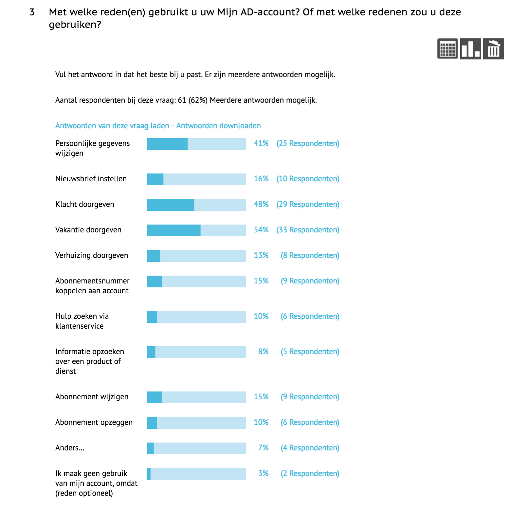
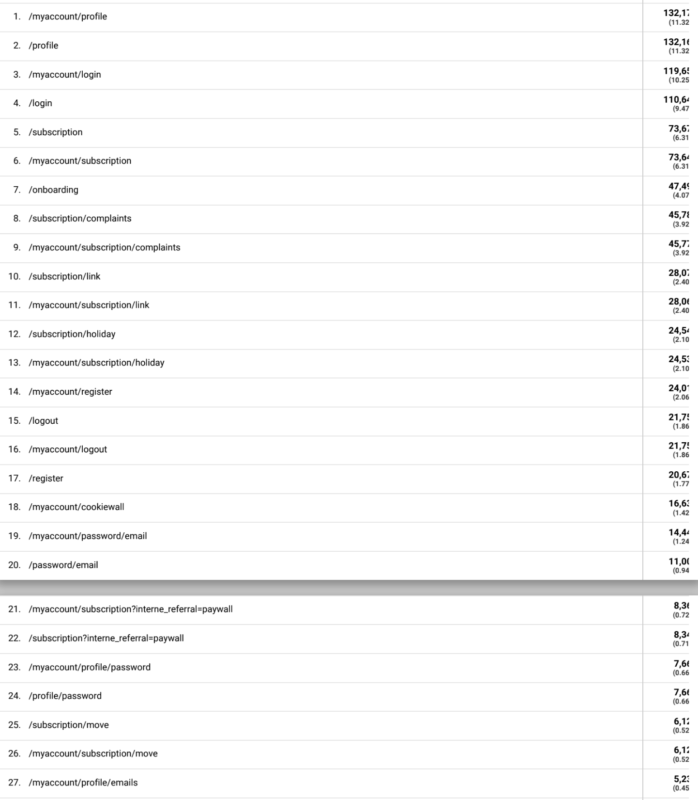

# 3.8 - Meest gebruikte functies op account

## Belangrijkste pagina's

Gebaseerd op [onderzoek van de klantenservice](2.8-klantenservice-research.md) en [Google Analytics](../h2-onderzoek/online-analytics.md) kan de volgende lijst opgesteld worden:

Enquete

1. Vakantie
2. Klacht
3. Persoonlijke gegevens
4. Abonnement wijzigen
5. Verhuizing
6. Nieuwsbrief instellen
7. Abo opzeggen
8. Abo nummer koppelen
9. Hulp via klantenservice
10. Info over dienst opzoeken

VS Google analytic

1. Abonnement overzicht
2. Klachten
3. Abo koppelen
4. Vakantie service
5. Registreren
6. Email aanpassen
7. Password aanpassen
8. Verhuizen
9. Postcode aanpassen
10. Verjaardag aanpassen

Opgesteld aan de hand van de volgende onderzoeksresultaten:

