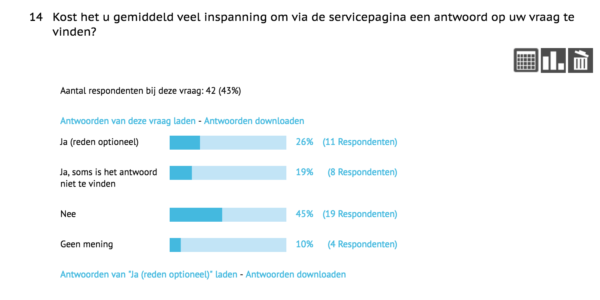

# 3.6 - Survey

## Enquete abonnees

Om meer informatie te achterhalen over hoe de abonnee met de site omgaat is er een enquete opgesteld. De enquete focust zich op de Mijn AD omgeving en de servicepagina. De enquete is uitgestuurd naar 4030 abonnees. Uiteindelijk is er een response geweest van 98. Dit komt neer op 2.4%.

Het proces van de enquete maken en opsturen was moeizaam. Dit kwam omdat een enquete naar de abonnee uitsturen veel invloed kan hebben op het gedrag van hen. Daarom moesten de vragen vaak worden nagekeken en worden goedgekeurd. Uiteindelijk heeft het zo een 3 weken geduurd voordat de enquete uitgestuurd kon worden.

Het opstellen van de vragen begon met enkele concept vragen. En wat is precies het doel van de enquete en wat willen we er mee bereiken. Dit is intern gecommuniceerd via het volgende document.

{% embed data="{\"url\":\"https://drive.google.com/open?id=14WooYy2Rr7kHGuCuAgPx4iUan6zXZT\_t\",\"type\":\"rich\",\"title\":\"enquete doel + vragen.pdf\",\"icon\":{\"type\":\"icon\",\"url\":\"https://ssl.gstatic.com/docs/doclist/images/icon\_14\_pdf\_favicon.ico\",\"aspectRatio\":0},\"thumbnail\":{\"type\":\"thumbnail\",\"url\":\"https://lh5.googleusercontent.com/byuyAeNdfNzFzmuZJ8h719ol\_\_aworwxRDASp\_zhOSgM\_ZeDp02mswvgcZ0=w1200-h630-p\",\"width\":1200,\"height\":630,\"aspectRatio\":0.525},\"embed\":{\"type\":\"reader\",\"url\":\"https://drive.google.com/file/d/14WooYy2Rr7kHGuCuAgPx4iUan6zXZT\_t/preview?usp=embed\_googleplus\",\"html\":\"
<iframe src=\\\"https://drive.google.com/file/d/14WooYy2Rr7kHGuCuAgPx4iUan6zXZT\_t/preview?usp=embed\_googleplus\\\" style=\\\"border: 0; top: 0; left: 0; width: 100%; height: 100%; position: absolute;\\\" allowfullscreen></iframe>
\",\"aspectRatio\":0.7071}}" %}

De vragen waren op dit moment al redelijk goed opgesteld. Maar hadden nog verbetering nodig. Het was belangrijk om de gebruiker bij een ja of nee antwoord de juiste flow te tonen. Sommige vragen kun je bij een bepaald antwoord namelijk niet meer tonen.

## Resultaten enquete

De uitkomsten van de survey zijn gedeeltelijk waar op gehoopt was. Maar een deel ook onverwachts. Omdat er geen rapport gedownload kon worden in pdf vorm is er een foto gemaakt van de survey in zijn geheel.



Over het algemeen zijn er veel afhakers. Van de 98 responses zijn er 43 gebruikers die daadwerkelijk alle vragen hebben doorlopen. Dit komt doordat sommige antwoorden zorgen voor het overslaan van bepaalde vragen. Er zijn dus wel 98 gebruikers geweest die de enquete hebben afgerond. Er zijn ook 58 mensen begonnen met de enquete maar later weer afgehaakt.

## Betrouwbaarheid van enquete

Er zijn paar opvallende uitkomsten te zien in de enquete. Zoals eerder vermeld zijn sommige resultaten niet helemaal zoals verwacht. Dit was verassend om te zien. Door de enquete ontstonden tegenstrijdige verhalen. Er zijn namelijk bevindingen gehaald uit het usability onderzoek, maar ook via de klantenservice intern is veel informatie opgevraagd. De bevindingen van deze twee onderzoeken stellen andere conclusies dan de enquete. De vraag was dan ook of een enquete überhaupt betrouwbaar is. Daarom is hier onderzoek naar gedaan.

Bijvoorbeeld uit gesprek analyse met de klantenservice bleek dat men behoefte had aan online financieel overzicht. Maar uit enquete blijkt dat men hier over het algemeen geen behoefte aan heeft. 

Een ander voorbeeld is dat uit het usability onderzoek blijkt dat men de Mijn AD omgeving lastig in gebruik vindt. En het niet snel zouden gebruiken door gebrek aan informatie en overzicht. Zij voelde zich ook niet welkom in deze omgeving. Met welkom werd bedoeld een warm en sympathiek gevoel.

Maar volgens de enquete vindt men het over het algemeen alles wel prima.

Waarschijnlijk als er gevraagd werd "Het kost veel moeite om wijzigingen door te geven en informatie op te vragen via Mijn AD.', dan kwam er een ander antwoord uit. Wanneer het een negatieve toon bevat dan duidt dat er op dat er iets niet goed is. Men zal dit dan ook eerder aannemen. Dit komt omdat de gebruiker een antwoord wilt geven dat de onderzoeker tevreden zal stellen. \("5 Reasons Why Survey Respondents Don’t Tell the Truth", z.d.\)[`[7]`](../literatuurlijst.md)

**Factoren die mogelijk kunnen bijdragen aan deze verschillende uitkomsten zijn:**

1. De manier van de vragen stellen en antwoorden geven
2. Lengte van de enquete
3. Leeftijd
4. Sociale druk of verwacht gedrag.

Het is een plausibele aanname dat niemand tijd heeft om een enquete in te vullen. Wanneer men dit wel doet gaan zij er vaak snel doorheen. Wanneer er dus veel tekst staat is men waarschijnlijk geneigd om niet alles nauwkeurig te lezen en gedeeltelijk op gevoel een antwoord te kiezen.

Een ander belangrijk aspect is dat een deel van de gebruikers nooit gebruik heeft gemaakt van bepaalde omgevingen of diensten, maar toch doorgaan met de vragen. Dit blijkt ook uit de antwoorden waar het optioneel was om een reden op te geven. Er werd dan zo nu en dan verteld 'ik heb dit nooit gebruikt'. Zij zouden dan eigenlijk nooit bij die vraag terecht moeten komen.

Volgens een artikel op Info Surv \("5 Reasons Why Survey Respondents Don’t Tell the Truth", z.d.\)[`[7]`](../literatuurlijst.md) wordt er gesteld dat er 5 redenen zijn waarom gebruikers niet eerlijk zijn in een survey.

1. **Respondents want to appear better than they are**. Whether that’s cooler, richer, more beautiful – respondents lie to build their self-worth.
2. **Respondents give socially desirable answers.** Survey estimates of respondent voting are always higher than actual voter turnout. That’s because you’re supposed to vote, right? So respondents lie about whether they vote or not.
3. **They don’t want to answer questions about sensitive behavior**. Sex. Personal finance. Drug and alcohol use. Illegal behaviors. Respondents are always more likely to lie about sensitive topics.
4. **People want to give the answer they believe will “help” or “please” the researcher**. Many people just want to help you \(the researcher\) out. And so they make up responses based on their belief about what you need.
5. **Respondents believe they can influence the outcome of the research in their favor.** If you absolutely love the product concept, you may say you will buy it more frequently than you actually think you will, in hopes of getting it introduced into the marketplace.

## Interessante bevindingen

Ook al kan een enquete onbetrouwbaar zijn, toch zijn er elementen uitgehaald die bijdragen in het maken van het product.

Vooral bij vragen die neutraal gesteld worden, kunnen als betrouwbaarder worden ervaren. Klanten kunnen hier namelijk niet een gewenst antwoord geven.

De meerderheid vind het gemak goed, maar er zijn ook veel voldoendes en enkele onvoldoendes. Dit betekent dus dat er ruimte is voor verbetering.

De inspanning bij de servicepagina is 50/50 verdeeld. Hieruit kan gesteld worden dat een groot deel dus moeite ondervindt en dat dit aspect verbeterd kan worden.

Het overzicht scoort over het algemeen ook goed en voldoende. Met een voldoende kan het echter een stuk verbeterd worden.

Men beoordeeld de service van het AD over het algemeen goed. Maar te zien is dat er veel gebruikers voor de voldoende en matig gaan. Hieruit kan ook meegenomen worden dat er veel ruimte is voor verbetering.

De meerderheid geeft aan liever gebruik te maken van een zoekbalk. Dit verhaal komt wel overeen met de usability test, waarin gebruikers ook al snel neigde naar de zoekbalk.

Zie verwijzing om meer te lezen over de zoekbalk



Ook hier is weer de vraag hoe betrouwbaar deze resultaten zijn. Maar het geeft wel interessant inzicht.

### Bekendbaarheid andere diensten

Zo komt ook naar voren dat de meerderheid vooral de digitale krant kent als dienst van het AD. De andere diensten zijn ongeveer even bekend bij de abonnees, maar dus wel een heel stuk minder dan de digitale krant.

## Conclusie

Ook al is er een onderzoek gedaan naar hoe betrouwbaar een enquete kan zijn, toch is er een groep die duidelijk aangeeft dat zij frustratie ondervinden in account en service, of dat er ruimte is voor verbetering. Bij de vragen die neutraal gesteld zijn komt naar voren dat het over het algemeen wel beter kan.

Een grote groep van de deelnemers zal ook nooit echt een probleem hebben ondervonden, en zich daarom waarschijnlijk niet goed kunnen inleven in de vragen. Zij geven dan een gewenst antwoord.

Een goede enquete opstellen met juiste vragen blijkt daarom een hele klus te zijn.

Tot slot zijn bovenstaande behandelde vragen slechts een kleine selectie van uit de hele enquete.

