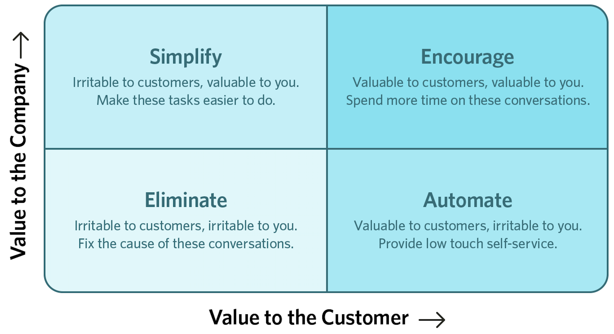
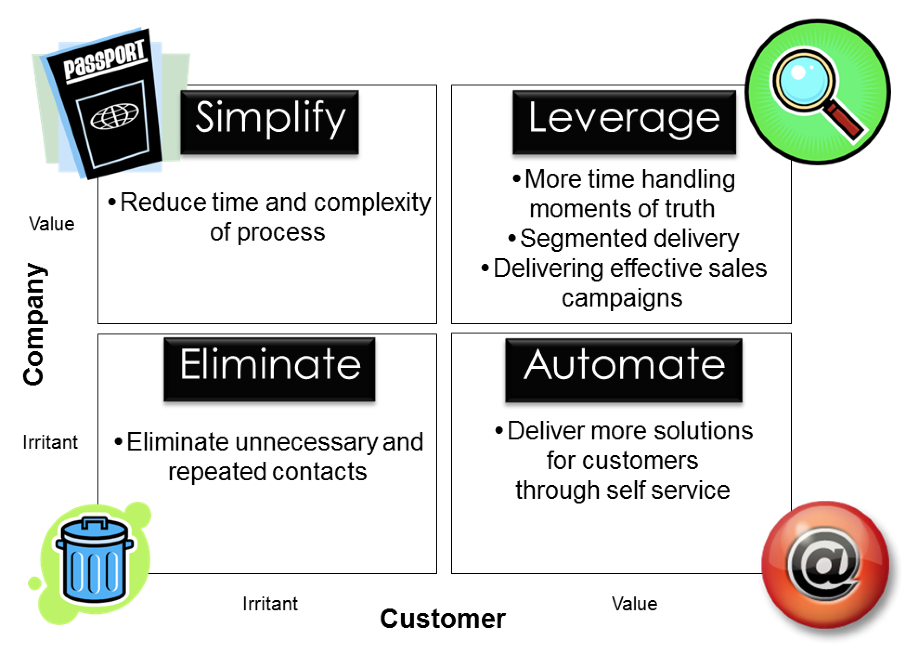
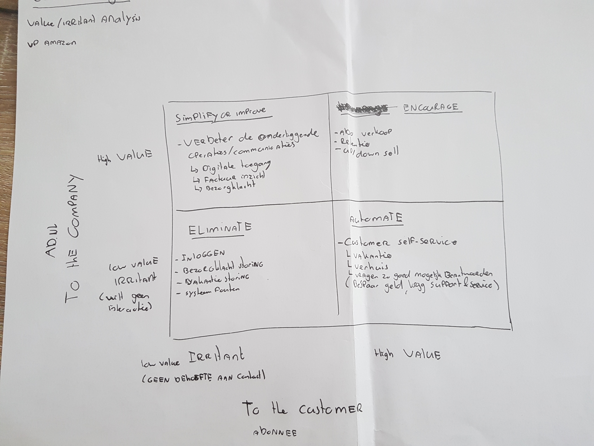

# 3.9 - Value-Irritant matrix

Aan de hand van het Value-Irritant matrix, opgesteld door de Vice President Bill Price van Amazon, kun je kijken waar je als bedrijf kansen kan vinden om iets te betekenen op het gebied van Customer Support. Oftewel hoe kan je de klant beter helpen. Op deze manier is er een focus bepaald waar het product zich op richt en waar de kansen zitten voor het AD.

## Wat is het matrix?

Onderstaande afbeeldingen geven weer wat het model inhoudt.

Aan de linkerkant zijn de matrixen voor het bedrijf, aan de onderkant die van de gebruiker.

Dat wat waarde heeft voor het bedrijf, en als irritatie wordt ondervonden door de gebruiker valt dus onder simplify. Dit is ook precies waar ik ga zitten met mijn product.

Het automatiseren van onderdelen heeft veel waarde voor de gebruiker, maar dit wordt vaak niet goed uitgevoerd of uberhaupt gedaan. Daarom is het voor een bedrijf een aspect dat voor frustratie zorgt, en dus onder het irritant matrix valt.

Wat zowel onnodig is voor het bedrijf als de gebruiker is onnodige contact momenten, of contact momenten die als irritant worden ondervonden.

De matrix waar zowel het bedrijf als de gebruiker waarde aan heeft is de 'leverage'/ 'encourage' matrix. Dit betekent meer tijd spenderen aan gesprekken met de klant, en het opzetten van doeltreffende campagnes. 

Onderstaand is mijn eigen Matrix ingevuld. De focus ligt vooral op Simplify en Automate. Door middel van self-service kan de gebruiker een heel eind komen.

