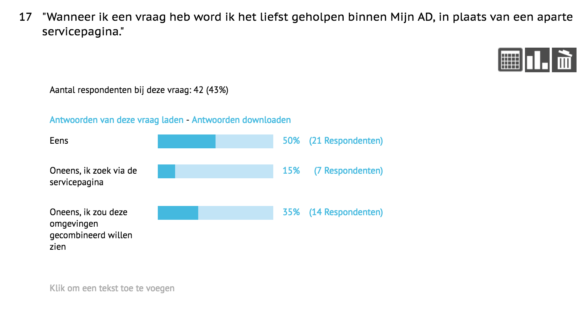
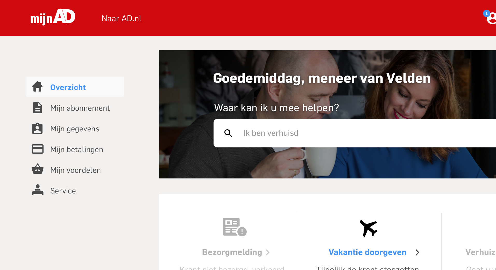
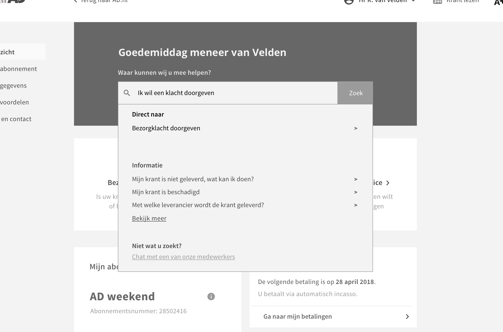
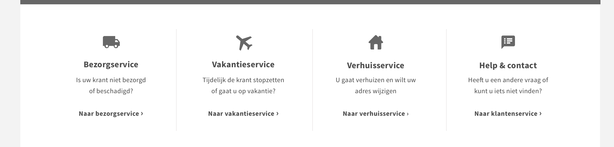
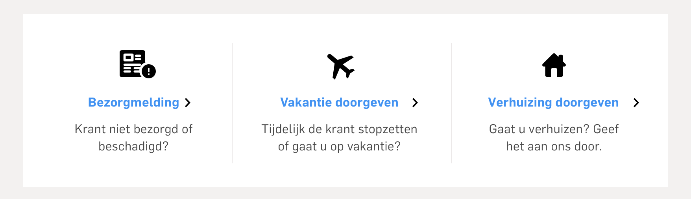

# 4.4 - Ontwerp onderbouwing

## Ontwerpkeuzes

Op basis van de lo-fi en wireframes zijn er uiteindelijk design keuzes gemaakt die het product vorm  geven en bijdragen aan het verbeteren van de klantenzorg. De belangrijkste bouwstenen van het design zal ik daarom toelichten. Alle details zullen later in de eindversie van het product worden geannoteerd en onderbouwd.

### Informatie architectuur principes

Het ontwerp leunt op de principes van informatie architectuur zoals is beschreven in [2.9 - Informatie architectuur principes](../h3-ideen-en-inzichten/2.9-informatie-architectuur-principies.md). Aan de hand van deze principes is er een structuur gemaakt van de content en zijn de principes in acht genomen tijdens het design proces.

### Een centrale omgeving

Een belangrijke designkeuze is het samenvoegen van de Mijn AD omgeving en de Servicepagina. Het idee is ontstaan nadat bleek uit de gebruikerstest en online analytics, dat veel gebruikers op hun account omgeving niet kunnen vinden wat ze zoeken. [Zie google analytics onderzoek](../h2-onderzoek/online-analytics.md#google-analytics-research). Ze komen vervolgens bij de servicepagina uit, waaruit ze 9/10 keer weer worden doorverwezen naar de Mijn AD omgeving, omdat hier alles te regelen valt.

Tevens is naar voren gekomen dat er twee inconsistente werelden zijn; account en servicepagina. Door deze splitsing ontstaat er verwarring bij de gebruiker en dit resulteert in veel zoekwerk en niet goed geholpen worden.

Vervolgens is er in de enquete de vraag gesteld hoe zij het liefst geholpen zouden willen worden. Het komt dus naar voren dat men het liefst binnen 1 omgeving geholpen wilt worden.

### 

### Navigatie

Er is gekozen voor een verticale navigatie waarbij de belangrijkste onderwerpen worden getoond. De navigatie blijft sticky in beeld staan wanneer de gebruiker omlaag scrolled. Op deze manier zal de content van deze omgeving altijd beschikbaar zijn.

De reden van deze verticale variant is omdat uit een artikel van Fly Patterns \("Vertical Navigation", z.d.\)`[`[`13`](../literatuurlijst.md)`]`de volgende punten komen:

* They are scalable. The number of menu items is not constrained by the viewport width.
* Vertical menus more readily adapt to small screen sizes. While horizontal menus can also be made responsive, it usually requires a transformation from horizontal to vertical. Since vertical menus are already in this format, the transition from desktop to mobile is less disorienting.
* Vertical navigation supports common left to right flow. Navigation categories are easily differentiated from other information that may exist in the header area of the application.

#### Google Analytics

De elementen van de navigatie zijn bepaald aan de hand van een [Google Analytics onderzoek](../h2-onderzoek/online-analytics.md#google-analytics-research). Er is gekeken naar o.a. de meest gebruikte pagina's.

#### Card sorting

Ook is de hiërarchie van de content bepaald door middel van een [card sorting test](../h3-ideen-en-inzichten/3.8-card-sorting.md).

In de lo-fi ontwerpen zijn er [3 varianten bedacht ](untitled.md#ontwerpconcept-navigatie-patroon)voor de navigatie. Geen van deze 3 opties zijn doorgevoerd. De optie die het meest in de buurt komt is de verticale navigatie

#### Progressive disclosure

Volgens het artikel van Nielsen \(Nielsen, 2006\)[`[15]`](../literatuurlijst.md)op Nielsen Norman Group willen gebruikers eenvoud, maar tegelijkertijd de 'macht' om veel opties te hebben. Dit wordt opgelost door Progressive disclosure. Zo kun je beide conflicten behandelen en de gebruiker tevreden houden.

1. In eerste instantie toon je gebruikers alleen een paar van de belangrijkste opties.
2. Je toont een grotere set aan opties wanneer zij hier om vragen. Oftewel door er op te klikken. Gebruikers kunnen alsnog doorgaan met hun taak, ook al krijgen zij meerdere opties voorgeschoteld. Zo hoeven zij zich geen zorgen te maken over de extra complexiteit.

### 

### Zoekbalk

De zoekbalk staat centraal in beeld en is op basis van voorgaand onderzoek \([2.1.7 - Zoekbalk onderzoek](../h2-onderzoek/search-bar-research.md)\) ontworpen. De zoekbalk staat op een centrale plek op de pagina. Door overige content blokken \(zie vorige design iteratie\) rondom de zoekbalk weg te halen, ligt de focus volledig op deze zoekbalk.

Het idee is om voor het typen al suggesties weer te geven die dan als een carrousel roteren. Op deze manier kan de gebruiker zien op wat voor woorden/zinnen je zou kunnen zoeken.

Ook zijn de suggesties die tevoorschijn komen bij typen in de zoekbalk belangrijk in het helpen van de gebruiker.

Wanneer een gebruiker begint met typen worden er suggesties gedaan op basis van de woorden die zijn ingetikt. De woorden klacht en doorgeven resulteert in een directe actie die de gebruiker kan uitvoeren.

Er wordt op basis van deze worden ook informatie getoond over het onderwerp. Door hier op te klikken ga je naar de service en contact waar meer informatie te vinden is over dat onderwerp.

Door de gebruiker de optie te geven dat als ze er vervolgens nog steeds niet uit komen, zij kunnen chatten met een medewerker.

### Content vorm

De content is gecentreerd geplaatst en scrolled mee, terwijl de navigatie en de top header blijven staan. De reden hiervoor is dat op deze manier de content behapbaar is en toegankelijk.

Er is gebruik gemaakt van een cards design pattern. 

Uit een artikel op ui-patterns \("Cards Design Pattern", z.d.\)[14](../literatuurlijst.md)  blijkt dat cards goed zijn voor het snel scannen van content. Het is een efficiënte methode om de content gestructureerd te houden en te gebruiker te helpen. 

Cards wekken ook de suggestie dat er meer content inzit wanneer je er op klikt. Meer content over het onderwerp. Het dient als een entry point. Het moet daarom niet overbeladen zijn met allerlei informatie en acties.

Cards zorgen er voor dat veel content in een behapbaar en klein formaat kan worden gestopt. Het verdeeld de content in betekenisvolle stukken en zorgt voor een samenvatting van de pagina. Een card zorgt ervoor dat er meer informatie over het onderwerp is te vinden na het klikken op zo een card.

### 

### Motorische vaardigheden van gebruikers

#### Interface optimaliseren voor doelgroep

De klantenzorg is niet alleen te verbeteren door juiste content te leveren en snelle zoekacties. Maar ook meedenken met de gebruikers op het gebied van motorische vaardigheden. De gemiddelde leeftijd van de gebruikers ligt rond de 59. Op oudere leeftijd neemt de visie af. Men prefereert dan grotere teksten. Kleine teksten zijn lastig in gebruik. Ook zijn er andere 

Volgens het artikel op Smashing magazine \(Campbell, 2015\)[`[16]`](../literatuurlijst.md)zijn er enkele vuistregels voor het optimaliseren van een interface voor mensen met een wat oudere leeftijd:

* Vermijd font groottes kleiner dan 16 pixels
* Laat men zelf de font grootte instellen
* Geef aandacht aan contrast ratios, vooral met teksten
* Test je product op screen readers
* Voeg ondertiteling toe in video of audio content als dit belangrijk is voor de user experience.
* Knoppen moeten minimaal 44x44 px zijn voor leeftijd tot 70 jaar, daarna groter.
* Houdt de afstand minimaal bij elementen die op een volgend worden gebruikt. Denk aan invulvelden.
* Interface elementen waar men op klikt met de muis moet op zijn minst 11mm diagonaal zijn.

Om deze reden is het ontwerp voorzien van een groot lettertype dat zowel voor jong als oud fijn te lezen is. Er is ook gekeken naar contrast. Met name de teksten op een achtergrond. Door middel van een contrast checker op Webaim \([https://webaim.org/resources/contrastchecker/](https://webaim.org/resources/contrastchecker/)\) is er gekeken of deze voldoet aan de richtlijnen.

#### Toevoegen font grootte knop

Door een knop in de interface toe te voegen die de font grootte vergroot, geef je de gebruikers de mogelijkheid zelf controle te hebben over hun interface. Hiervoor is een generiek icoon gebruikt.

### 

### Icoon gebruik

Het ontwerp maakt veel gebruik van iconen. Iconen zorgen er voor dat men het gevoel krijgt dat ze er op kunnen klikken, dat de context van een element snel te herkennen is, het hoeft niet vertaald te worden, omdat het universeel bekend is en het is visueel aantrekkelijk. Aldus de Nielsen Norman Group \(Harley, 2014\) [`[17]`](../literatuurlijst.md). Gebruikers moeten iconen in een oogopslag kunnen herkennen anders is de context verwarrend.

Zo bleek dat bij het gebruiken van een vrachtwagen bij 'bezorgservice' de context niet werd begrepen. Dit had zowel te maken met het woord als het icoon. De teksten zijn later aangepast in het ontwerp.

Voor het gebruik van de iconen is gebruik gemaakt van Google Material Icons. Deze iconen worden universeel toegepast door Google en hebben een duidelijke uitstraling. Er zijn enkele uitzonderingen waarbij een icoon 'custom made' is. Een voorbeeld hiervoor is het bezorgservice icoon, dat later veranderd is naar bezorgmelding.

