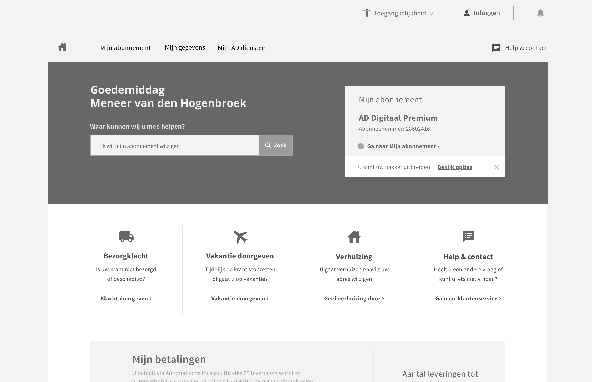

# 4.3 - Medium-fidelity

## Inleiding

Na enkele iteraties en schetsen is er een medium fidelity ontwerp gerealiseerd, waar vervolgens een test mee is uitgevoerd. Deze medium fidelity is een iteratie op voorgaand design en bevat een nieuwe structuur en hiërarchie.

De onderbouwing van het design wordt in hoofdstuk [4.4 - Ontwerp onderbouwing](4.3-designkeuzes.md) behandeld.

## Aanpassingen

Aan de hand van een expert review \(door Terry van der Heijde\) is er gekeken naar het ontwerp. Het kwam naar voren dat de hiërarchie van de content blokken er voor zorgde dat de pagina erg druk was. Met name het eerste deel van het scherm dat als 'intro' dient en de gebruiker gelijk op weg moet helpen. Zoals te zien in onderstaande afbeelding zijn er te veel elementen die aandacht vragen. Zowel de zoekbalk, als de navigatie, als de services als Mijn abonnement. Daarom is het design op de schop gegooid en is er een andere manier bedacht om met de content om te gaan.

Een andere belangrijke wijziging is het standaard font grootte. Daar waar er eerst voor 14pt groot werd gekozen is dit veranderd naar een standaard van 16pt. Dit heeft voornamelijk betrekking op de body text.

Verder is de navigatie structuur veranderd op basis van onderzoek \(te vinden in H4.4\) en is het design in het algemeen uitgelijnd op een grid en netter verwerkt.

## Medium-fidelity

De schermen van het ontwerp zijn te vinden in de volgende pdf. 

{% embed data="{\"url\":\"https://drive.google.com/file/d/19VFy2ygYPzmPNfu4l8ly5fkSK-3PfSks/view?usp=sharing\",\"type\":\"rich\",\"title\":\"AD klantenzorg me-fi prototype.pdf\",\"icon\":{\"type\":\"icon\",\"url\":\"https://ssl.gstatic.com/docs/doclist/images/icon\_14\_pdf\_favicon.ico\",\"aspectRatio\":0},\"thumbnail\":{\"type\":\"thumbnail\",\"url\":\"https://lh3.googleusercontent.com/66G3sBBsCIsZLaA8SiSQXdo6IpSK6h3CDy6uhQaaXTbH5i7cRMoWBtbywdU=w1200-h630-p\",\"width\":1200,\"height\":630,\"aspectRatio\":0.525},\"embed\":{\"type\":\"reader\",\"url\":\"https://drive.google.com/file/d/19VFy2ygYPzmPNfu4l8ly5fkSK-3PfSks/preview?usp=embed\_googleplus\",\"html\":\"
<iframe src=\\\"https://drive.google.com/file/d/19VFy2ygYPzmPNfu4l8ly5fkSK-3PfSks/preview?usp=embed\_googleplus\\\" style=\\\"border: 0; top: 0; left: 0; width: 100%; height: 100%; position: absolute;\\\" allowfullscreen></iframe>
\",\"aspectRatio\":0.7071}}" %}

Aan de hand van dit design is er een prototype gemaakt en getest op verschillende gebruikers.



