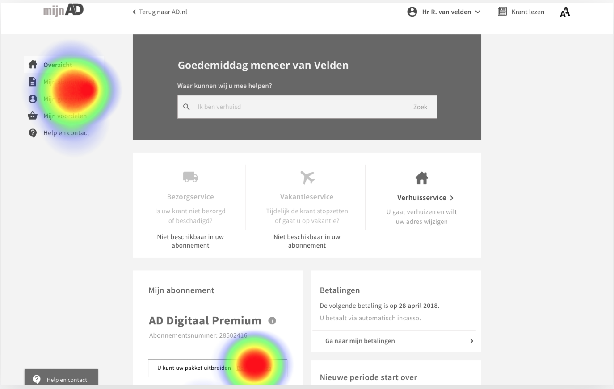
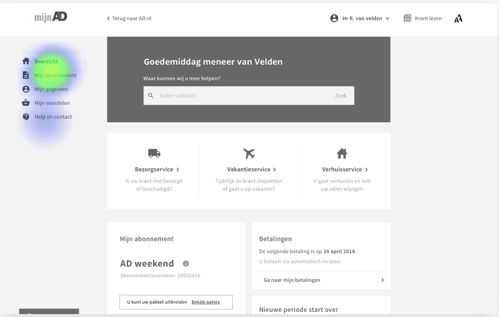

# 4.5 - Prototype test 1.0

## Usability test \(informeel\)

Om te onderzoeken of het medium-fidelity design duidelijk was zijn er enkele taken aangemaakt met het programma maze.design. Hier in worden gebruikers uitgenodigd om bepaalde taken uit te voeren. Aan de hand van heatmaps en vooraf ingestelde paden, is te zien hoe de gebruiker omgaat met het ontwerp.

### Resultaten

### Taak 1: inloggen 

* 22 testers
* Direct pad &gt; login blok: 60% succesvol
* Indirect pad &gt; top rechts icoon: 40% succesvol
* Heatmap geeft veel clicks weer. Met nadruk op Mijn Ad, Mijn abonnement, Login top, zoekbalk, en login blok. 

### Taak 2: abonnement koppelen

* 24 testers
* Direct pad: 33.3% succesvol

* Indirect pad: 50% succesvol

### 

### Taak 3 : 2e email toevoegen

* Testers 22
* Direct pad &gt; via zoekbalk: 0% succesvol
* Indirect pad: 90% succesvol
* Een deel navigeert via de topnavigatie op de Mijn gegevens pagina. Een deel scrolled direct door naar de 'wijzig' knop.

### 

### Taak 4: Upgraden abonnement naar AD Weekend pakket

* Testers 22
* Direct pad &gt; via zoekbalk: 0% succesvol
* Indirect pad &gt; via de knop in het mijn abonnement content blok: 90% succesvol
* Pad via linker navigatie was niet uitgewerkt &gt; wel veel clicks.
* Een groot deel wilt het vinden via de linker navigatie, maar deze was niet klikbaar.

* Op de mijn abonnement pagina navigeert men via de topnavigatie naar 'abonnement details'. Hier klikt men op het 'i'tje' dat meer informatie zou tonen. Dit is niet klikbaar.
* Men klikt ook op bekijk tarieven.

* Upgraden van het pakket is duidelijk. Door het uitwerken van een bepaald pad moet er eerst 'wat zit er in mijn pakket' getoond worden. Daarom is de heatmap niet accuraat in dit resultaat. Men klikt blijkbaar ook op de prijs.

### 

### Taak 5: Melding maken van de verkeerde krant die is ontvangen

* Testers 21
* Direct pad &gt; via het service contentblok: 47% succesvol

* Indirect pad: 38.1%
* Indirect pad 1 &gt; via Mijn abonnement: 4 users

* Indirect pad 2 &gt; via zoekbalk: 3 users

Opvallend is dat men ook de neiging heeft om op help en contact te drukken. Over het algemeen wordt de knop 'bezorgservice' het meest gebruikt. Maar het gaat gelijk op met andere paden. Het doel is om men zo makkelijk mogelijk dit soort zaken te laten regelen. De vraag die dan ook ontstond was waarom er verdeeldheid in het regelen van deze taak zit.

### Taak 6: Grotere teksten aanzetten \(en weer uit\)

* Testers 21
* Direct pad &gt; via icoon rechtsboven: 65% succesvol
* Door een fout in het prototype raakte sommige testpersonen in een loop waardoor zij afhaakte.

### Taak 7: Chatten met een medewerker

* Testers 19
* Direct pad &gt; via de knop help en contact: 73.7% succesvol

Over het algemeen zijn is de context 'help en contact' voldoende voor de gebruiker om te weten waar ze moeten zoeken. De verwarring zit het in welke knop tot het doel leidt. In dit geval was er 1 pad uitgewerkt, en dat is via de knop links onder. Een percentage van 15% klikte op de knop in de navigatie

### Taak 8 : Uitleg en informatie over Digitaal lezen

* Testers 19
* Direct pad &gt; via de zoekbalk: 36.8% succesvol
* Een groot aandeel klikt op de digitale krant, omdat de taak het woord digitaal lezen bevat. Een ander onderwerp was waarschijnlijk beter geweest om te testen.
* Men drukt veel op mijn abonnement of mijn gegevens

* Indirect pad &gt; via de linker navigatie 'help en contact': 47.4% succesvol
* Men verwacht het over het algemeen onder de 'help en contact' knop.

### 

### Taak 9: Uitloggen

* Testers 19
* Direct pad &gt; via account naam rechtsboven: 100% succesvol
* Soms klikt men op terug naar ad.nl om weg te komen uit de omgeving. Dit kan ook, maar was niet van toepassing in dit prototype.

## Bevindingen

Aan de hand van dit onderzoek en de testpersonen te hebben ondervraagd is er een lijstje met feedback uitgekomen. Er zijn ook een hoop aspecten die goed gaan, deze zijn niet altijd samengevat.

Feedback en opvallende punten:

* Over het algemeent wordt de zoekbalk niet gebruikt. 
* Bij complexere vragen als ‘informatie over digitaal lezen’ dan wel. Pas als men echt vastloopt dan gebruiken zij de zoekbalk. Of ze zouden dan gaan chatten/bellen.
* De side navigatie is opvallend en wordt vaak als eerste gezien.
* Men verwacht email wijzigen onder persoonsgegevens niet onder inlog
* Het volgende moet worden gecombineerd: emailadres, wachtwoord, en persoonlijke gegevens. In plaats van los van elkaar zetten.
* De woorden bezorgservice, vakantieservice, verhuisservice zijn niet aktie gericht. Het is beter om bezorgservice= melding krant. vakantie service = vakantie doorgeven. Verhuisservice = verhuizing doorgeven
* Icoon van bezorgservice dekt niet de lading.
* Het groter maken van de tekst is soms niet duidelijk. Misschien + - erbij, of vergrootglas
* Fontgrootte instellingen via gegevens.
* Help en contact veranderen naar servicepagina, of service voor u
* Abonnement koppelen &gt; het woord zelf al de knop maken.
* Meer contrast in de knoppen maken. Men weet soms niet dat dit een knop is.
* Enkele zochten via het ‘zelf regelen’ blok, maar de meeste navigeren direct via de navigatie links.
* Veel scrollen in pagina's als Mijn abonnement en Mijn gegevens.

## Conclusie

Het ontwerp toont aan dat de zoekbalk niet perse gebruikt wordt. Dit kan te maken hebben dat men niet wist dat deze balk überhaupt interactief was, omdat het een prototype is. Of omdat de structuur van de pagina al duidelijk richting geeft. Na dit te hebben nagevraagd bij de testpersonen bleek het om een combinatie van beide te gaan, maar gaven zij aan dat ook al zou die wel werken, ze het niet snel zouden gebruiken. De reden dat hiervoor werd gegeven is dat een zoekbalk nooit doet wat zij willen. Dat het vaak niet goed is uitgewerkt en irrelevante suggesties geeft.

Over het algemeen worden de taken snel uitgevoerd. Het navigeren vanaf Mijn Ad overzicht is duidelijk en snel. Wanneer men kwam op een detail pagina, dan was het soms even zoeken naar de juiste content, of waar er geklikt moest worden. Dit lag ook aan het prototype doordat er maar enkele paden waren uitgewerkt. Daarnaast lag het deels aan de teksten, dat deze niet genoeg de context beschrijven of een foutieve suggestie opwekken. En soms was het gewoon even zoeken naar de juiste content.

