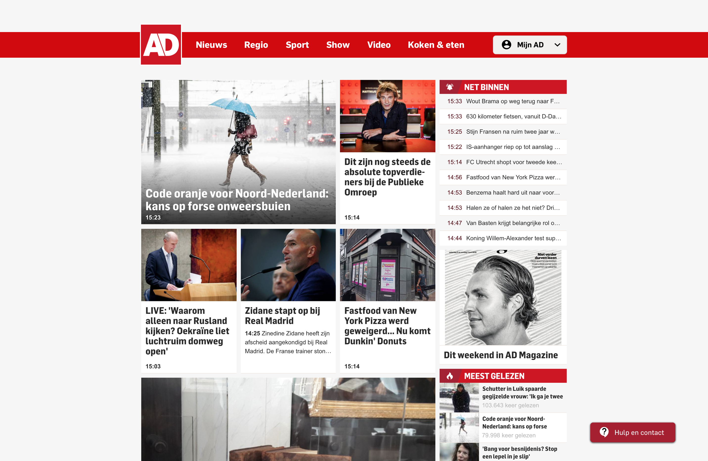

# 4.7 - AD.nl landingspagina structuur

## Inleiding

Naast de Mijn AD omgeving is er gekeken naar hoe de gebruiker op deze omgeving terecht zou komen.

De landpagina van ad.nl is de nieuwspagina en bevat veel elementen. [Uit eerder onderzoek](../h3-ideen-en-inzichten/2.2.1-resultaten.md) bleek al dat de navigatie niet duidelijk was en men veel aan het zoeken was naar de juiste content.

Op basis van deze bevinding zijn er iteraties gemaakt op de homepagina. Het is belangrijk dat dit goed word ontworpen, want dit is de gebruiker zijn eerste touch-point, en zal van hier uit navigeren naar alle content. Deze iteraties zijn te vinden in het volgende document.

{% embed data="{\"url\":\"https://drive.google.com/file/d/1sYGK8SRXcwvPqYiDqzf4-u9MmT2R2Swc/view?usp=sharing\",\"type\":\"rich\",\"title\":\"ad nl navigatie iteratie.pdf\",\"icon\":{\"type\":\"icon\",\"url\":\"https://ssl.gstatic.com/docs/doclist/images/icon\_14\_pdf\_favicon.ico\",\"aspectRatio\":0},\"thumbnail\":{\"type\":\"thumbnail\",\"url\":\"https://lh3.googleusercontent.com/D4oF-QD8nPuePdKMOAiCpDqyznkgpFlIzp7o6p3F5XG7UABMAk\_k44RysBs=w1200-h630-p\",\"width\":1200,\"height\":630,\"aspectRatio\":0.525},\"embed\":{\"type\":\"reader\",\"url\":\"https://drive.google.com/file/d/1sYGK8SRXcwvPqYiDqzf4-u9MmT2R2Swc/preview?usp=embed\_googleplus\",\"html\":\"
<iframe src=\\\"https://drive.google.com/file/d/1sYGK8SRXcwvPqYiDqzf4-u9MmT2R2Swc/preview?usp=embed\_googleplus\\\" style=\\\"border: 0; top: 0; left: 0; width: 100%; height: 100%; position: absolute;\\\" allowfullscreen></iframe>
\",\"aspectRatio\":0.7071}}" %}

Zoals te zien is in de afbeeldingen, zijn er veel verschillende iteraties gemaakt. Het ontwerp was gelimiteerd omdat het ad werkt met een boxed layout. Het was niet de bedoeling dat ik buiten mijn scope zou treden en deze pagina ook zou veranderen. Daarom is er voor gekozen om dit binnen het huidige grid te houden.

### Floating button

Er is ook een variant geweest waarbij de 'Hulp en contact' knop als een floating button in scherm zweefde. Hier is uiteindelijk niet voor gekozen omdat de nieuwspagina al veel elementen en visuele prikkelingen bevat. De keuze is gevallen op navigatie elementen boven in het scherm te houden.

Daarnaast wanneer men een lagere resolutie heeft, zal het beeld zich meer gaan vullen. De floating button zal dan over de content heen vallen. Wat zorgt voor meer drukte op de pagina. Dit is dus geen goede design keuze.

## A/B test

De vraag was welk ontwerp uiteindelijk het beste aansluit bij de wensen van de gebruiker. Een belangrijke bevinding is dat wanneer men geen abonnee is, zij niet op 'Mijn AD' zullen drukken. Omdat zij geen account hebben, verwachten zij dit hier ook niet. Je wilt hen dus niet de optie ontnemen om geforceerd via 'Mijn AD' te navigeren.

Via Usability Hub is er een test opgezet die de gebruiker vroeg welke variant zij qua bruikbaarheid het prettigst vonden. Het ging gelijk op tussen 2 designs. Maar uiteindelijk is er voor de variant, met een volle rode balk te kiezen. Op deze manier is er ook weinig ruis, doordat de bovenkant niet verspring van kleur, maar begint met rood, en maar een keer overgaat in wit.

{% embed data="{\"url\":\"https://drive.google.com/file/d/1H9KQ5Y5mR5lhDVN7DBSxytrzA7xTuql3/view?usp=sharing\",\"type\":\"rich\",\"title\":\"Ad.nl homepagina voorkeur • UsabilityHub.pdf\",\"icon\":{\"type\":\"icon\",\"url\":\"https://ssl.gstatic.com/docs/doclist/images/icon\_14\_pdf\_favicon.ico\",\"aspectRatio\":0},\"thumbnail\":{\"type\":\"thumbnail\",\"url\":\"https://lh3.googleusercontent.com/P0oY37vVLlWKJCTzCKNhDSlBbrMwDZdAjmZbabQvXkFThcX4lrEoseoba9U=w1200-h630-p\",\"width\":1200,\"height\":630,\"aspectRatio\":0.525},\"embed\":{\"type\":\"reader\",\"url\":\"https://drive.google.com/file/d/1H9KQ5Y5mR5lhDVN7DBSxytrzA7xTuql3/preview?usp=embed\_googleplus\",\"html\":\"
<iframe src=\\\"https://drive.google.com/file/d/1H9KQ5Y5mR5lhDVN7DBSxytrzA7xTuql3/preview?usp=embed\_googleplus\\\" style=\\\"border: 0; top: 0; left: 0; width: 100%; height: 100%; position: absolute;\\\" allowfullscreen></iframe>
\",\"aspectRatio\":0.7071}}" %}

Bestaande abonnees klikken bij een vraag ook sneller op 'Service en contact' dan 'Mijn AD', blijkt uit onderzoek van de test.

Wanneer je de knop 'service en contact' in zijn geheel zou weghalen. Dan ga je het onnodig moeilijk maken voor de gebruiker om tot zijn doel te komen. Je wilt ze dus niet forceren om te zoeken onder 'Mijn AD'. 

**De conclusie die getrokken kan worden is dat men meerdere ingangen nodig heeft.** Je wilt verschillende type gebruikers op deze manier te dienst staan.

