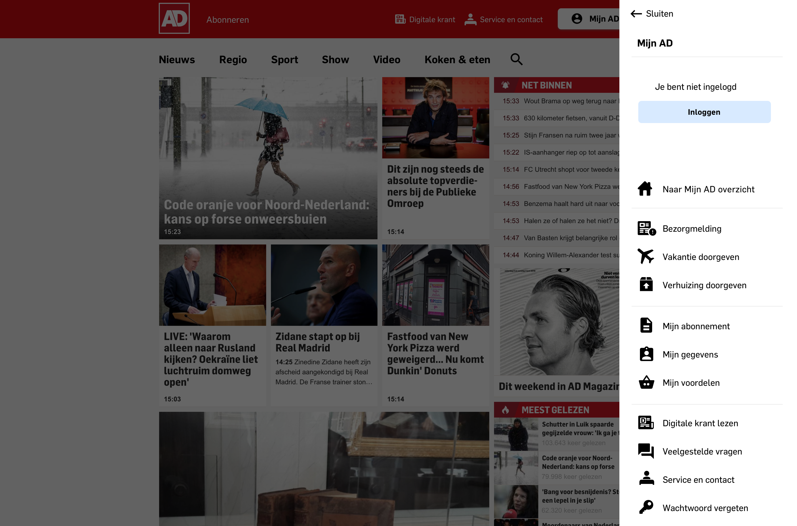
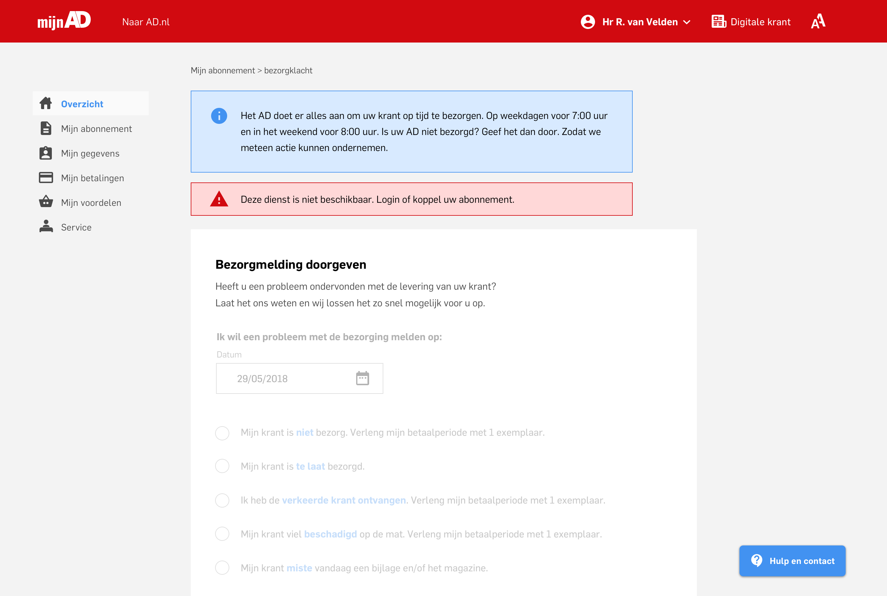
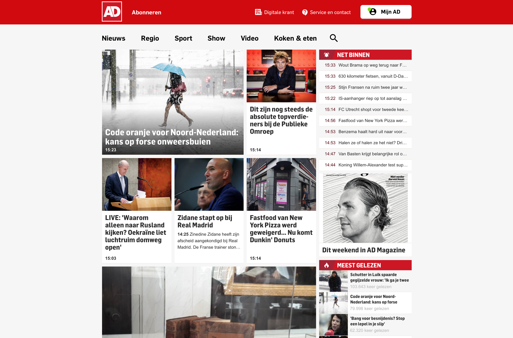
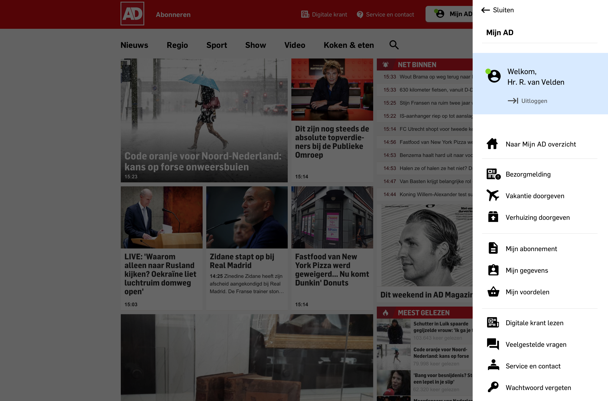

# 4.8 - Actie gericht navigeren

## Inleiding

Het product dat ik maak is geen product voor dagelijks gebruik. Het kan wel, maar men zal hier vooral terecht komen wanneer zij gebruik willen maken van hun diensten, een vraag hebben of een wijziging willen doorvoeren.

Een gebruiker zal dus vrijwel altijd van te voren een doel hebben wat zij willen voltooien. Er zal misschien een enkele uitzondering zijn van gebruikers die 'exploren' en even kijken wat de omgeving allemaal kan en doet.

Op basis van de [Job to be Done en de Job stories](../h3-ideen-en-inzichten/jobs-to-be-done-framework.md) kunnen er al verschillende doelen worden gedestilleerd. Het hoofddoel van de gebruiker is zo efficiënt mogelijk zijn doel voltooien. Om dit te voltooien is er een zijbalk ontworpen dat tevoorschijn komt wanneer de gebruiker op 'Mijn AD' klikt. Zie onderstaande afbeelding.

Men wordt dus niet gelijk doorgestuurd naar de Mijn AD omgeving, maar krijgt eerst een lijst aan opties. Deze lijst moet er voor zorgen dat men actie gericht kan zoeken. 

Bijvoorbeeld wanneer een abonnee zijn vakantie wilt doorgeven. Dan kan hij dit regelen door naar de Mijn AD omgeving te gaan, en hier te zoeken. Of hij kan via de zijbalk gelijk zijn doel vinden, en naar de desbetreffende pagina gaan om het te regelen.

Dit element speelt een grote rol in de self-service die ik de gebruiker wil bieden. Op deze manier weet de gebruiker dat er aan hen gedacht is. Want hun doel staat immers al gelijk na een klik in beeld. Wat je hierdoor creëert is een gevoel van vertrouwen, en daarmee waardering naar je klant toe. Zoals blijkt uit onderzoek naar self-service.

Aan de hand van het **principe 'disclosure'**, welke beschreven wordt in [2.9 - Informatie architectuur principes](../h3-ideen-en-inzichten/2.9-informatie-architectuur-principies.md), kan de structuur van deze zijbalk worden ingedeeld. Aan de hand van iconen + bijschrift krijgt de gebruiker een preview van wat voor informatie zij krijgen wanneer zij dieper graven. Oftewel met de muis klikken.

## Inlog en geen inlog

Een van de belangrijkste opties van dit ontwerp is dat men gebruik kan maken van de Mijn AD omgeving zonder hiervoor in te loggen en hoe dan ook actiegericht kan zoeken. Op deze manier kan de content altijd worden gezien en bezocht worden ongeacht de type gebruiker.

Verschillende types kunnen zijn:

* Een bestaande abonnee die is ingelogd
* Een abonnee die eerst naar zijn doel wilt zonder in te loggen
* Een bezoeker die geen abonnee is

Wanneer een gebruiker niet is ingelogd maar besluit om naar een detail pagina te gaan. Dan zal daar vervolgens de gebruiker gevraagd worden om in te loggen, om zo daadwerkelijk, bijvoorbeeld, een wijziging te maken.

Dit ziet er als volgt uit:

De gebruiker ziet dus alle opties, kan binnen de omgeving naar alle content gaan, alleen bij het doorvoeren van een wijziging zal de gebruiker moeten inloggen of zijn account koppelen. Op deze manier zal men altijd kunnen uitkomen bij informatie dat zij zoeken. Wat erg belangrijk is volgens het [onderzoek naar self-service](../h2-onderzoek/2.9-self-service-onderzoek.md).

Wanneer men is ingelogd krijgen zij een ander scherm te zien dat duidelijk onderscheidend is dan niet ingelogd zijn. De naam wordt vermeld en door middel van een groen bolletje ziet men duidelijk dat zij 'online' zijn en dus zijn ingelogd.

