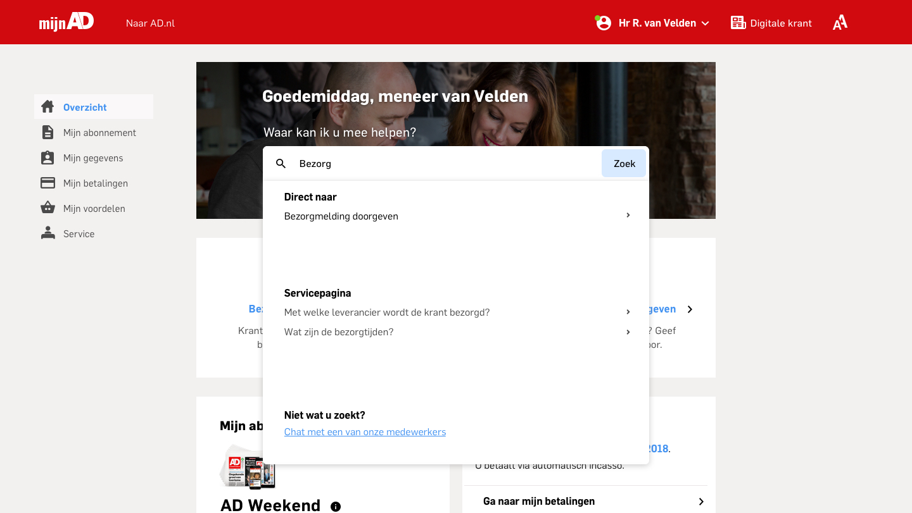

# 4.9 - Werking zoekbalk

De zoekbalk maakt gebruikt van een preview waarin er enkele suggesties gedaan worden waar de abonnee op zou kunnen zoeken. Deze suggesties roteren als een carroussel, door middel van een animatie.

Op deze manier ziet de abonnee wat de zoekbalk voor termen aankan en dat het dus mogelijk is om actiegericht te zoeken.

Hieronder worden de stappen beschreven over hoe de zoekbalk zou werken.

### Stap 1

Zero-state. De carroussel animatie speelt af en toont suggesties van zoektermen.

### 

### Stap 2

Gebruiker klikt op het zoekveld. De suggesties verdwijnen en gebruiker kan starten met typen.

### 

### Stap 3

Gebruiker begint met typen. Het levert tot nu toe geen resultaten op. Dit wordt aangegeven door middel van feedback. De 'zoek' knop veranderd ook van status. Deze is nu actief. De abonnee kan hier eventueel op drukken om zo een lijst met resultaten te krijgen. Dit is echter verder niet uitgewerkt in het design.

### Stap 4

De gebruiker typt meer letters. Het vormt samen een woord en daardoor verschijnen er opties.

### Stap 5

De gebruiker maakt zijn zoekterm af. De actie die uitgevoerd kan worden blijft hetzelfde. De informatie bij 'Servicepagina' wordt echter aangepast omdat het nu meer relevante zoekresultaten oplevert.

### Animatie van zoekbalk

Het duur enkele seconden voordat de animatie van start gaat.

