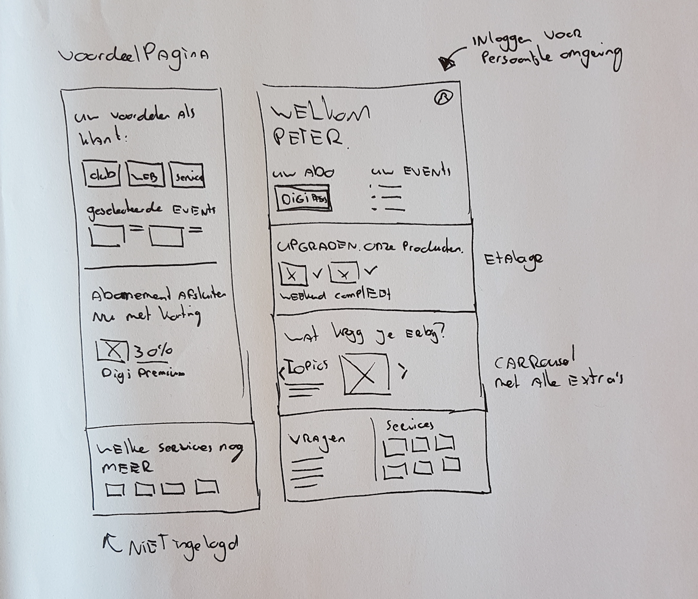
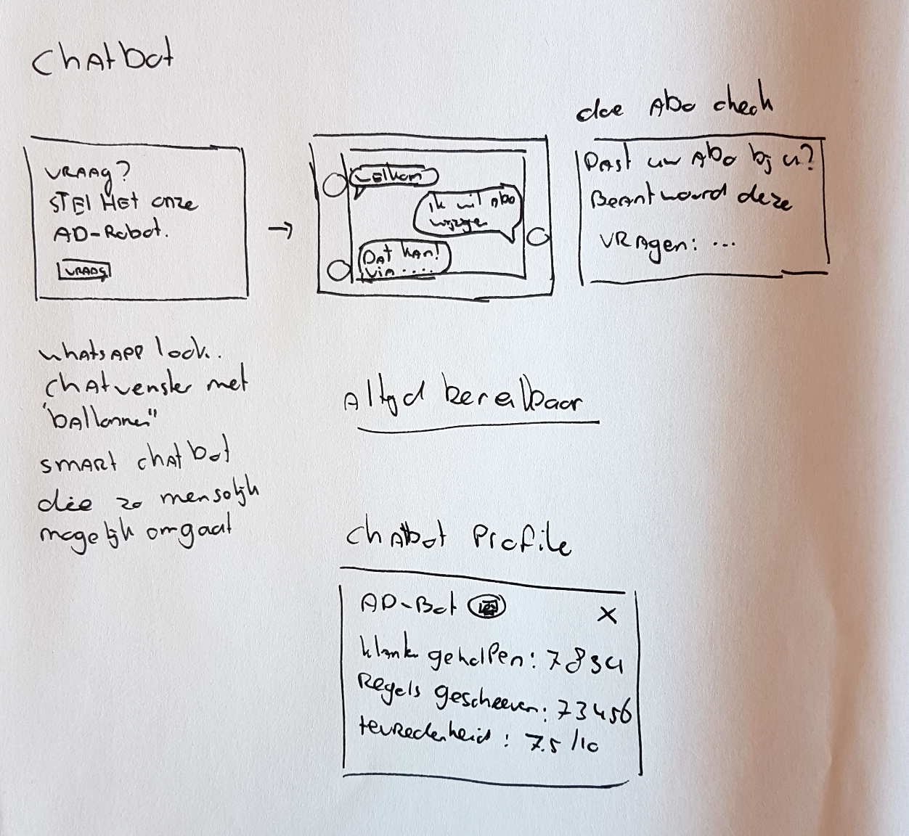
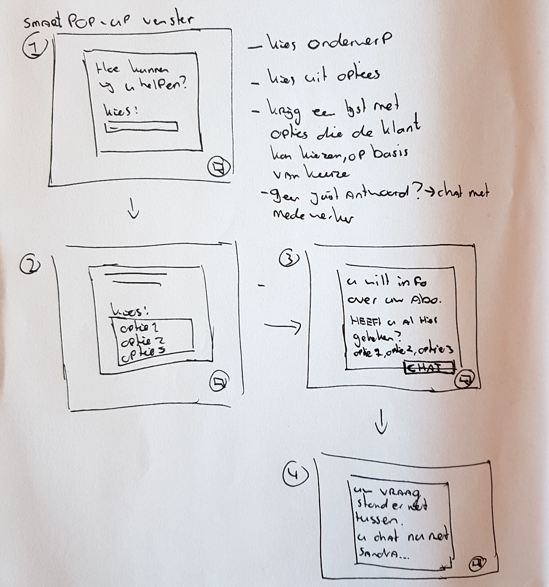
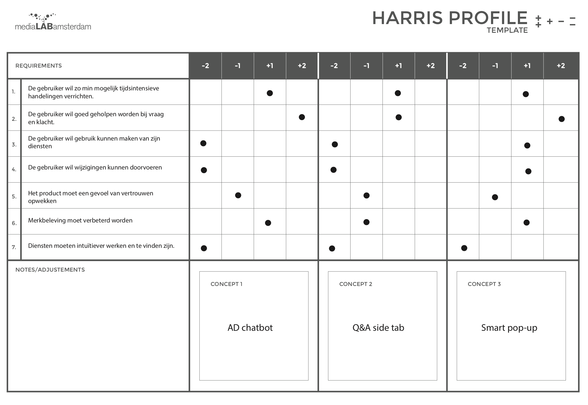
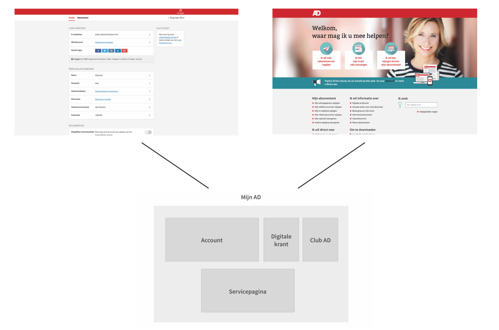
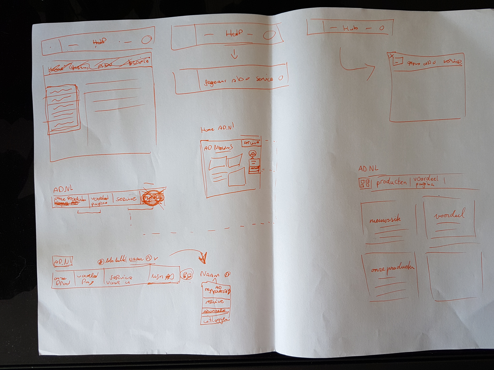
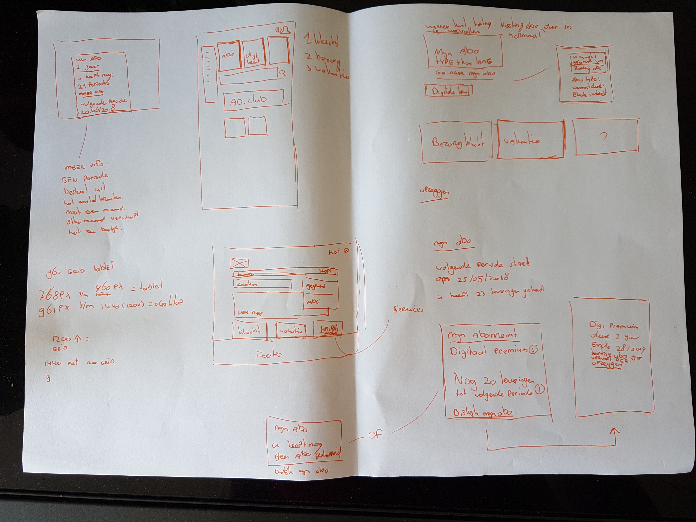

# 4.1 - Concept en schetsen

## Conceptfase

De concepten zijn opgedeeld in verschillende fases van het project. Deze fasen zijn opgesteld omdat de opdracht eerst anders gevormd was en daarom andere ideeën bedacht zijn. Bij verdere ontwikkeling van het project pasten deze niet meer bij de visie en begon er een nieuwe fase.

## Fase 1 concepten

Eerste ideën op basis van eerste opdracht vorming

* Voordeelpagina
* Chat functie verbeteren
* Community forum
* Loyality punten systeem

Vervolgens zijn de voordeelpagina en loyality punten systeem uitgewerkt. Zie volgende afbeeldingen.

### 1. Voordeelpagina

Het idee van de voordeelpagina is om zowel abonnees als niet abonnees een omgeving te geven waar zij alle voordelen kunnen zien. Hiermee wordt bedoeld Club AD, Webwinkel, Digitale krant, Puzzels etc. vervolgens kunnen zij ook alle abonnementspakketen zien van het AD. En een makkelijke manier om up te graden als je al abonnee bent.

Om de abonnee goed te servicen wordt opgesomt hoe zij geholpen zouden worden, en worden er veel gestelde vragen geplaatst om snel oplossingsgericht te antwoorden.

### 2. Loyalty punten systeem

Om de abonnee meer te waarderen en hen een gevoel te geven dat zij bij de club horen is er bedacht om een punten systeem op te zetten. Gebruikers zouden dan punten verdienen waarmee ze vervolgens uitjes kunnen boeken. Punten verdien je door puzzels te maken, artikelen te lezen of automatisch wekelijks etc. Op deze manier stimuleer je de pro activiteit.

## Fase 2 concepten

De opdracht is, zoals eerder verteld, in een later stadium vervormd en in een ander jasje gegoten om meer te focussen op klantenzorg. Dus de abonnee zo goed mogelijk te dienen bij vraag, probleem en wijziging.

De vorige concepten dragen hier niet voldoende aan bij.

Daarom zijn er 3 nieuwe concepten bedacht

* Chatbot
* Q&A side tab \(question & answer\)
* Smart pop-up venster

### 1 Chatbot

Om de abonnee beter te dienen is het idee ontstaan om de chat functie te verbeteren door middel van een chat bot. Op deze manier zou de abonnee minder snel contact opnemen via de telefoon. Maar juist gaan chatten met deze bot om zo snel mogelijk geholpen te worden met hun vraag. Het voordeel van een chatbot is dat deze 24/7 beschikbaar is en gebruik maakt van een database om antwoorden te geven.

Je zou een vraag kunnen stellen aan de AD-bot, en vervolgens krijg je een passend antwoord. Word je uiteindelijk niet goed geholpen dan zou je kunnen chatten met een echte medewerker.

### 2 Q&A side tab

Een button plaatsen op elke pagina die overal en wanneer dan ook gebruikt kan worden. De Q&A tab geeft content weer op basis van de pagina waar de gebruiker zich bevindt. Op deze manier worden er opties gegeven die relevant kunnen zijn in het oplossen van de vraag van de gebruiker. De knop zal altijd aan de rechter zijkant van het scherm zitten. De Q&A tab bevat ook een zoekbalk waar de gebruiker zijn vraag kan intypen. De omgeving zal dan zo accuraat mogelijk relevante content tonen.

### 

### 3 Smart pop-up venster

Door middel van een icoon in de hoek van de pagina kan de gebruiker een scherm oproepen die een zoekbalk weergeeft. De gebruiker kan dan een zoekterm opgeven, en krijgt verschillende opties te zien die op dat onderwerp aansluiten. De smart pop-up raadt vervolgens wat je te zien zou willen krijgen

## Harris profile

Op basis van de concepten is er een analyse uitgevoerd door middel van een Harris profile. De smart pop-up zou volgens deze analyse het beste werken.

Uiteindelijk kwam naar voren dat deze concepten niet het probleem gaan oplossen.

Er is tot de conclusie gekomen dat de kern van het probleem opgelost gaat worden door meer te focussen op self-service. Hier is over te lezen in [hoofdstuk 2.18. Self-service onderzoek](../h2-onderzoek/2.9-self-service-onderzoek.md). Dit zal er voor zorgen dat het product persoonlijker wordt en dat de gebruiker zelf de controle heeft. Daarnaast draagt self-service bij aan merkbeleving. Dus het gevoel dat het AD is er voor hun klant. En wanneer een gebruiker een account aanmaakt voelt het als zijn eigen plekje, aldus Wagner, A. E. \(2017, 5 oktober\). Op deze manier bouw je o.a. vertrouwen op en een band met de gebruiker, zoals Isaiah Bollinger \(Bollinger, 2015\) dat beschrijft.

Dus in plaats van dit te bereiken via 1 nieuwe feature of functie wordt er gekeken naar het geheel. Waar gaat het op grote schaal fout. Dit blijkt uiteindelijk te gaan om de manier hoe men geholpen wordt via de website van het AD. Er is gebrek aan een goede informatie architectuur en gebruikers worden niet actiegericht geholpen.

## Fase 3 concept

### Mijn AD

Uiteindelijk is dus tot de conclusie gekomen dat een enkele functie dus niet voldoende bijdraagt aan het oplossen van het probleem. Daarom is er onderzocht wat de gebruiker nu echt wilt, en waar zij tegen aan lopen. Aan de hand van surveys, interviews, en een usability test is dit in kaart gebracht. Zie voorgaande hoofdstukken voor deze onderzoeken.

Uit het probleem blijkt dat er twee werelden zijn. De account en de servicepagina. Deze zijn inconsistent en helpen de gebruiker niet voldoende. Het idee is om deze twee werelden te combineren tot één geheel. Op deze manier heeft de gebruiker één centrale omgeving waar alle vragen, wijzigingen en problemen opgelost kan worden.

Het concept kreeg op deze manier de naam: Mijn AD. Waarbij Mijn AD dus een centrale rol speelt in het dienen van de gebruiker bij vraag, wijziging en probleem.

Onderstaande afbeelding geeft een snelle schets weer van hoe de werelden samen zouden komen.

Enkele schetsen omtrent het concept van Mijn AD

