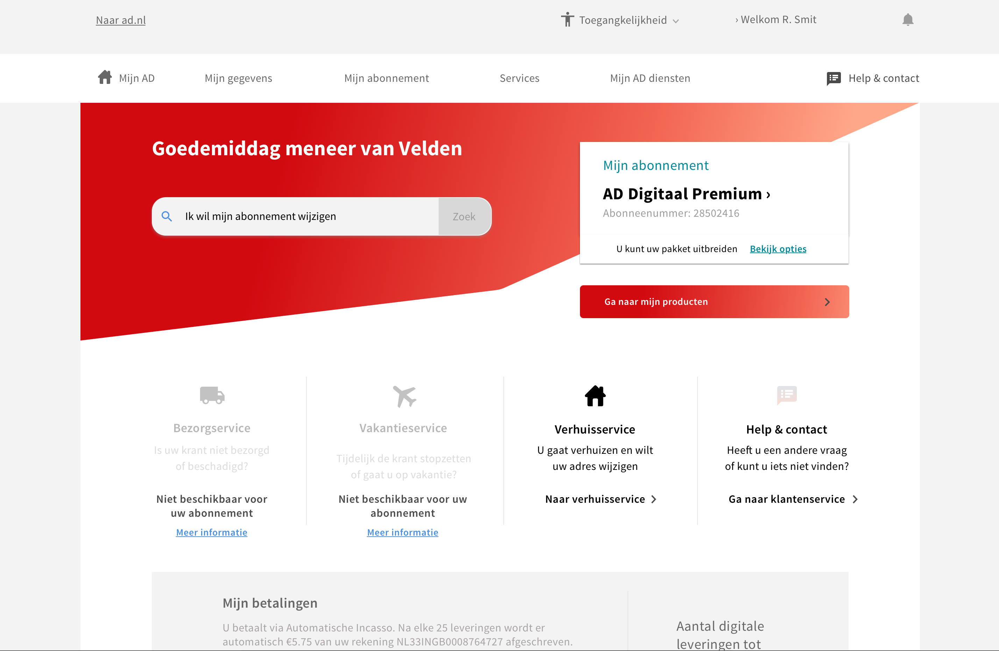
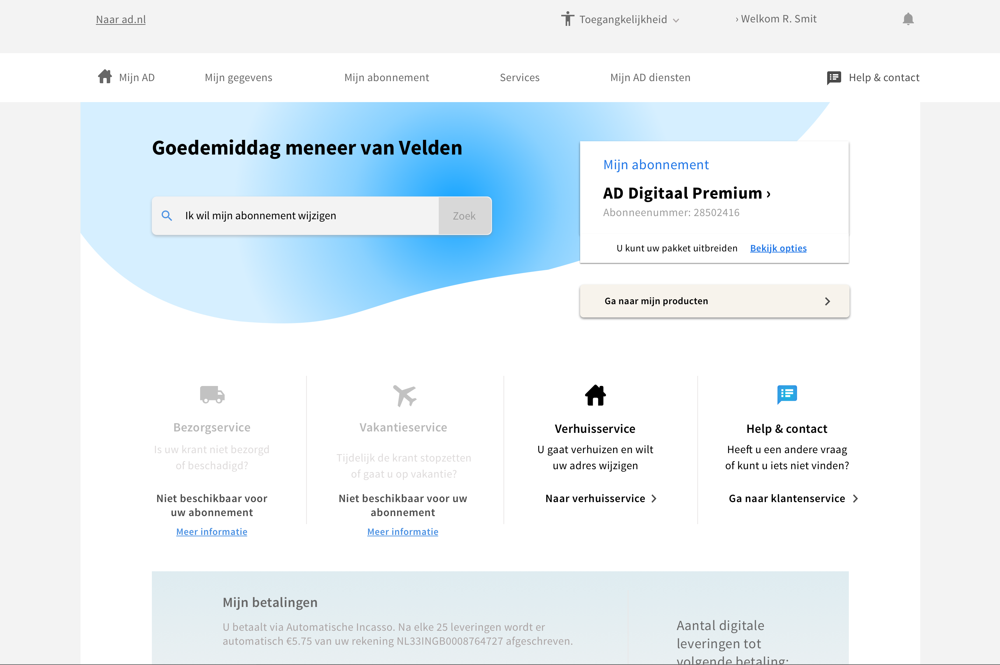

# 4.6 - Visueel ontwerp

## Inleiding

Na het testen van het prototype is alle feedback verwerkt en is het ontwerp voorzien van een visuele laag. Deze visuals zijn tot stand gekomen aan de hand van de huisstijl gids van het AD.

## Eerste iteratie

Door het gebruik van rode tinten in combinatie met blauw/groene accenten kon er een kleuren palette worden samengesteld. Door de schuine hoeken toe te passen moest het ontwerp een speels uiterlijk krijgen.

Door ronde vormen en zachte blauwe tinten te gebruiken, was geprobeerd om sympathiek op te wekken. Dit sloeg echter de plank mis en kwam visueel niet lekker uit de verf.

## Uiteindelijk visueel ontwerp

Het AD maakt gebruik van veel rood, donker rood en hier en daar blauw tinten. Door overal rood toe te passen in Mijn AD wordt de omgeving druk. Na overleg met de designer intern is besloten om meer voor de blauwe tinten te gaan in combinatie met een zachte pastel blauw. Op deze manier komen de pagina's rustiger over, sluit het nog steeds aan bij het AD, maar heb je wel het gevoel dat je in een andere omgeving zit.

De schermen zijn in het volgende document te bekijken.

{% embed data="{\"url\":\"https://drive.google.com/file/d/1q6yn5xeIdk0HC3eFVOrp3NjLilqnrtm\_/view?usp=sharing\",\"type\":\"rich\",\"title\":\"Mijn AD visueel ontwerp.pdf\",\"icon\":{\"type\":\"icon\",\"url\":\"https://ssl.gstatic.com/docs/doclist/images/icon\_14\_pdf\_favicon.ico\",\"aspectRatio\":0},\"thumbnail\":{\"type\":\"thumbnail\",\"url\":\"https://lh6.googleusercontent.com/dd6cPSSAQiMxc09wBXkLNIVs\_WLfYfb8dsX1IKsH2norrW\_gQVdGiXU3h88=w1200-h630-p\",\"width\":1200,\"height\":630,\"aspectRatio\":0.525},\"embed\":{\"type\":\"reader\",\"url\":\"https://drive.google.com/file/d/1q6yn5xeIdk0HC3eFVOrp3NjLilqnrtm\_/preview?usp=embed\_googleplus\",\"html\":\"
<iframe src=\\\"https://drive.google.com/file/d/1q6yn5xeIdk0HC3eFVOrp3NjLilqnrtm\_/preview?usp=embed\_googleplus\\\" style=\\\"border: 0; top: 0; left: 0; width: 100%; height: 100%; position: absolute;\\\" allowfullscreen></iframe>
\",\"aspectRatio\":0.7071}}" %}

