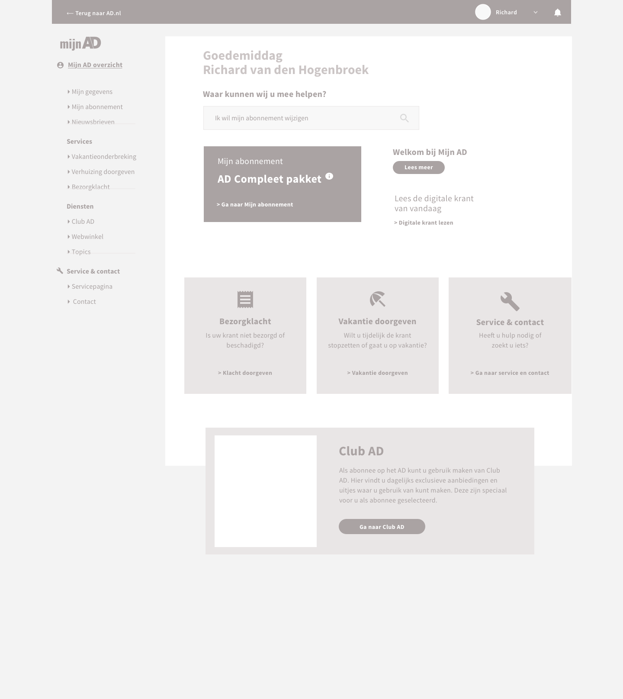
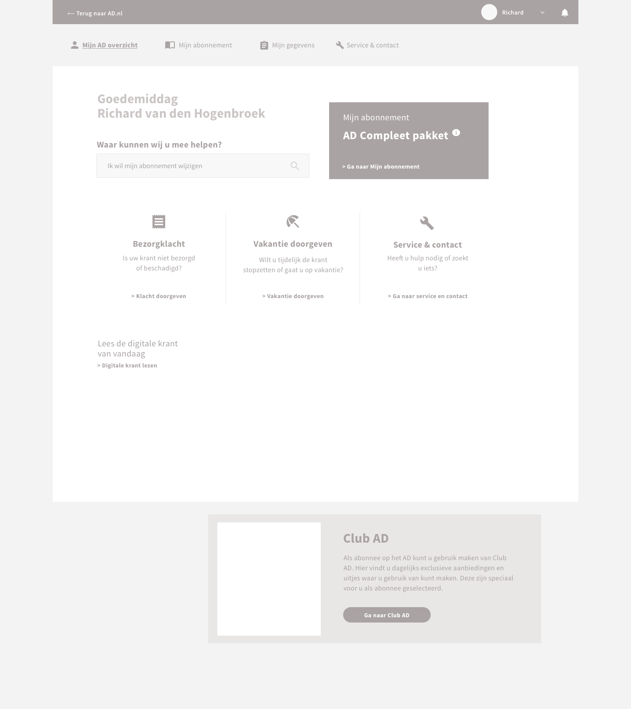
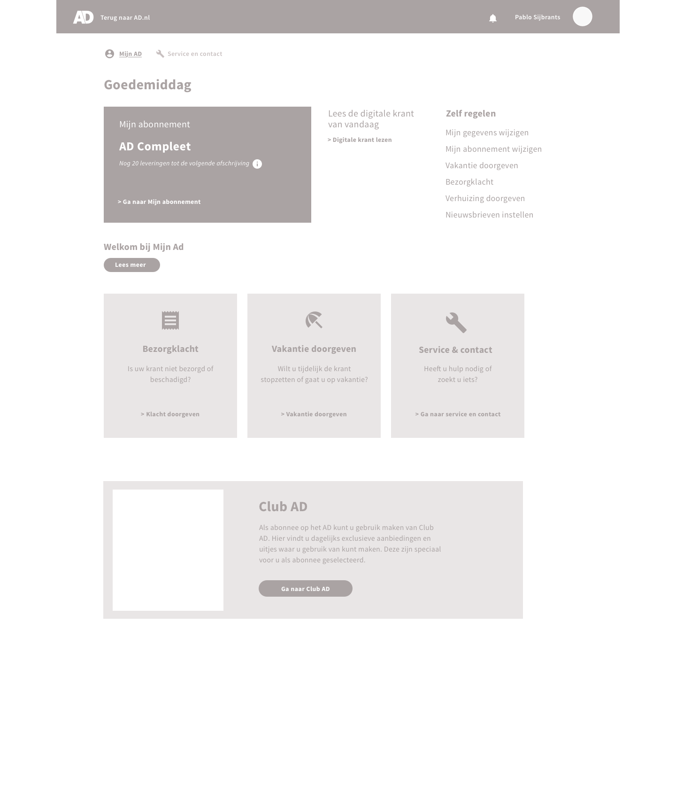
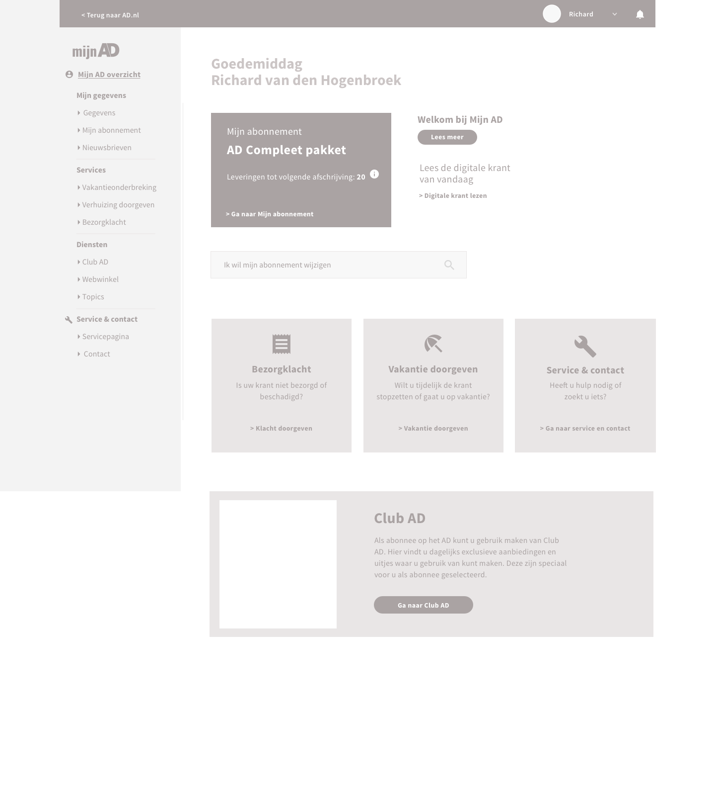
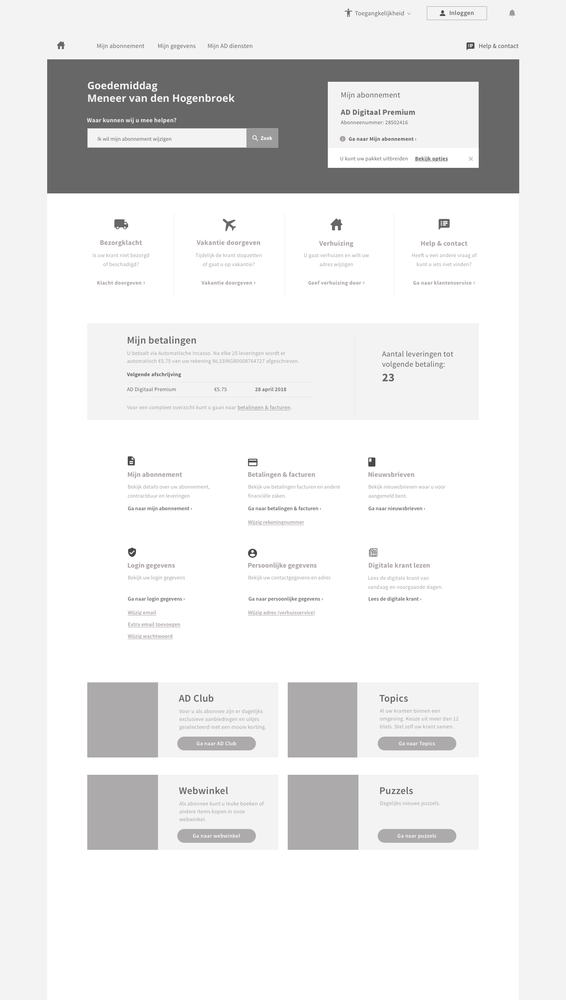
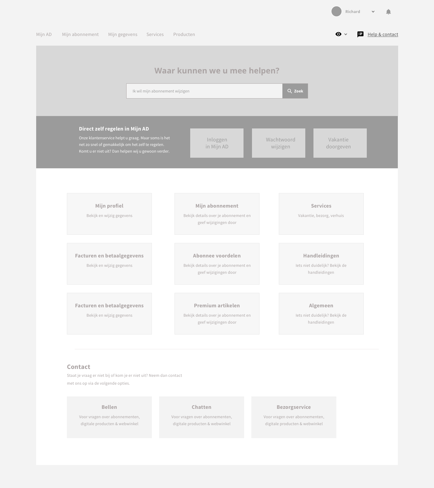
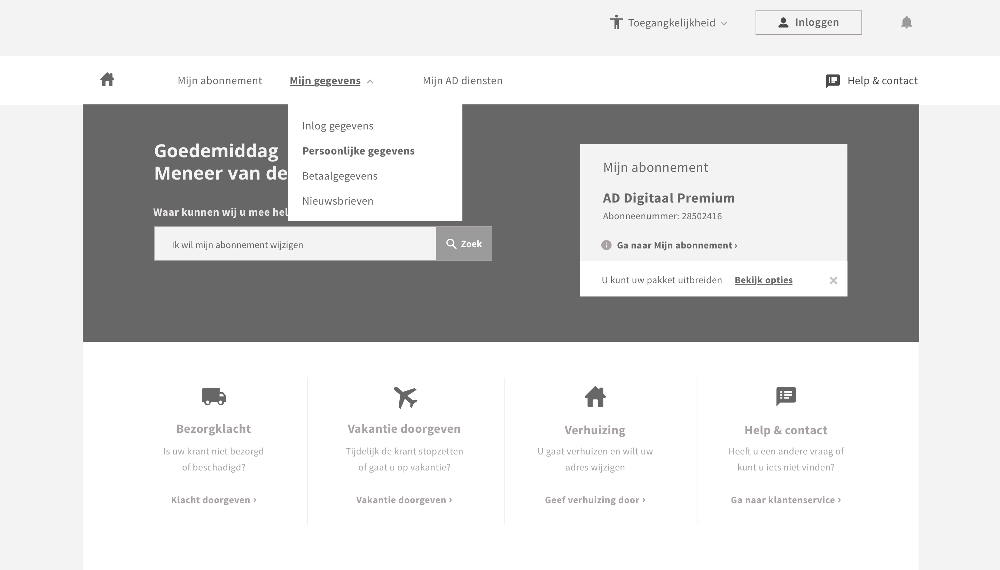
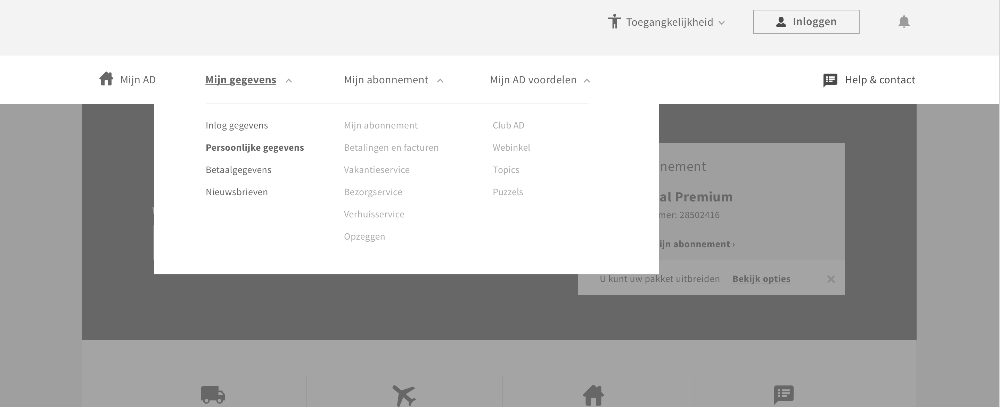
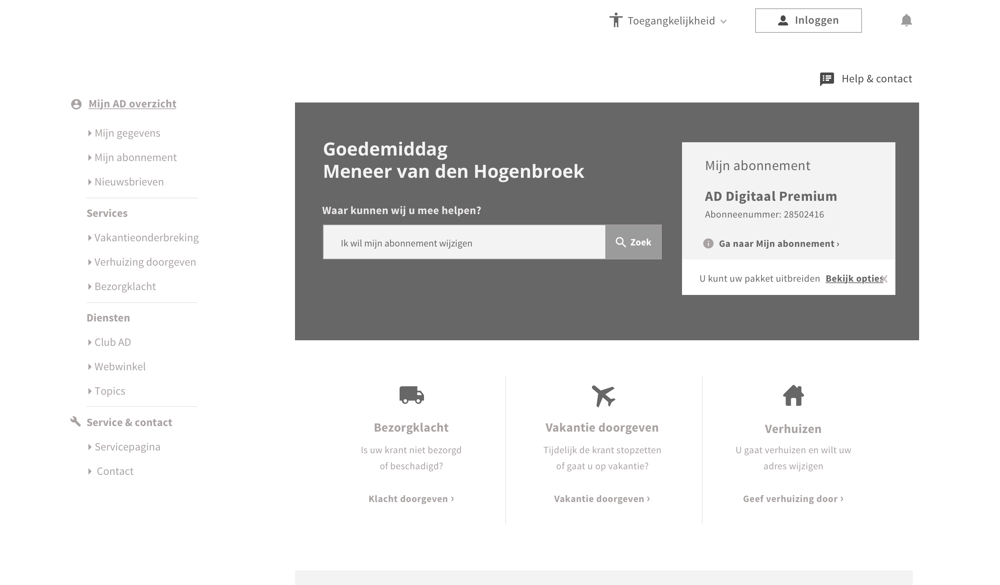

# 4.2 - Wireframes en lo-fi

## Inleiding {#conceptontwerpen}

Na de conceptfase zijn er in Sketch enkele conceptontwerpen gemaakt. Het belangrijkste hierbij was om verschillende manieren te bedenken die de behoeftes van de gebruiker zo goed mogelijk behandelt. 

## 1e iteratie wireframes & lo-fi

In de eerste designs is er vooral gekeken naar alle functies die de gebruiker zou kunnen gebruiken.

Er zijn enkele blokken designed waarin informatie staat. Ook is er gekeken naar de navigatie. Hoe kon dit het beste worden geplaatst zodat de gebruiker eenvoudig kan navigeren.

## 2e iteratie wireframes

Op basis van vorig design is er een iteratie gemaakt. De pagina is voorzien van meer vorm en er is nagedacht over de hiërarchie van alle elementen. De zoekbalk valt hier gelijk op, waarbij er aan de rechterkant het abonnement wordt uitgespeeld om direct te zien wat je hebt als abonnee. Vervolgens zit er een rij blokken onder met acties die de gebruiker veel gebruikt.

Verder is er een financieel overzicht in verwerkt, kan men snel zaken regelen via de opsomming van acties, en worden de voordelen uitgespeeld in blokken. De gebruiker kan hier op klikken en wordt dan doorgeschakeld naar de juiste content.

De servicepagina is ook op de schop gegooid. Het idee was om de content te structureren in blok vormen. Op deze manier moet de content snel scanbaar zijn en duidelijk worden wat voor informatie er 'onder' het blok zou zitten.

## Ontwerpconcept: navigatie patroon

Tijdens het ontwerpen zijn er aantal belangrijke keuzes gemaakt die de hiërarchie van de content bepalen.

### Navigatie

Er zijn verschillende opties ontworpen met betrekking tot de navigatie. Wat is de positie en hoe gedraagt de dropdown zich.

#### Optie 1: Horizontale navigatie met dropdown.

De content wordt hier geplaatst onder een dropdown. De navigatie heeft een horizontale layout.

#### 

#### Optie 2: Horizontale navigatie + volledige dropdown

Een horizontale navigatie waarbij alle opties in een oog opslag te zien zijn. Op deze manier toon je de gebruiker wat er allemaal mogelijk is.

**Optie 3: Verticale navigatie + alle opties zichtbaar**

De 3e optie was het plaatsen van een verticale navigatie, waarbij alle opties te zien zijn zonder eerst te klikken.

